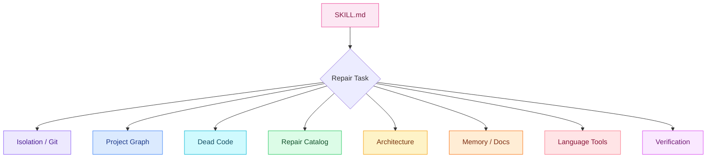

```mermaid
flowchart LR
    A["Clone"] --> B["Baseline"]
    B --> C["Understand"]
    C --> D["Map Relationships"]
    D --> E["Find Root Cause"]
    E --> F["Repair"]
    F --> G["Verify"]
    G --> H["Update Graphs"]
    H --> I["Document"]

    style A fill:#EDE9FE,stroke:#8B5CF6,color:#4C1D95
    style B fill:#DBEAFE,stroke:#3B82F6,color:#1E3A8A
    style C fill:#CFFAFE,stroke:#06B6D4,color:#164E63
    style D fill:#DCFCE7,stroke:#22C55E,color:#14532D
    style E fill:#FEF3C7,stroke:#F59E0B,color:#78350F
    style F fill:#FFEDD5,stroke:#F97316,color:#7C2D12
    style G fill:#FFE4E6,stroke:#FB7185,color:#881337
    style H fill:#FCE7F3,stroke:#EC4899,color:#831843
    style I fill:#FAE8FF,stroke:#D946EF,color:#701A75
```

<div align="center">


<br />

# Millie Fix

### Understand first. Repair second. Prove the result.

A research-driven **repository repair, debugging, refactoring, architecture recovery, dead-code analysis, optimization and documentation skill** for AI coding agents.

<br />


<br /><br />


<br />

**Clone it. Understand it. Map it. Fix it. Verify it. Document it.**

</div>

---

<table>
<tr>

<td width="20%" align="center">


### Isolate

Repair inside a separate clone instead of experimenting on the only copy.

</td>

<td width="20%" align="center">


### Understand

Map files, symbols, functions, routes, data flow and dependencies.

</td>

<td width="20%" align="center">


### Repair

Fix root causes, spaghetti code, architecture and structural problems.

</td>

<td width="20%" align="center">


### Clean

Remove dead and unused code only when evidence supports deletion.

</td>

<td width="20%" align="center">


### Verify

Build, test, analyze, inspect and record the actual result.

</td>

</tr>
</table>

---

#  What is Millie Fix?

**Millie Fix** is a portable Agent Skill designed for AI coding agents working on real software repositories.

It is intended for situations such as:

```text
"This project has become messy."

"Fix the errors."

"Clean the code."

"Remove unused functions."

"Improve the architecture."

"Find dead code."

"Optimize this project."

"Understand this repository."

"Refactor this application."

"Repair the structure without breaking functionality."

"Make this production ready."
```

Most coding agents can modify code.

Millie Fix is designed to make them answer a more important question first:

> **What does this code actually do, what depends on it, and what could break if I change it?**

---

#  Core Safety Principle

Millie Fix does **not** begin by modifying the original repository.

Its preferred workflow is:

```text
ORIGINAL PROJECT
      │
      │ read-only inspection
      ▼
ISOLATED REPAIR CLONE
      │
      ├── analysis
      ├── relationship mapping
      ├── fixes
      ├── refactoring
      ├── cleanup
      ├── tests
      └── documentation
```

The original repository remains the baseline.

---

#  Safe Repository Isolation

For a local Git repository, Millie prefers:

```bash
git clone --no-hardlinks /path/to/original /path/to/project__millie-fix
```

rather than immediately editing the source repository.

A typical structure becomes:

```text
Projects/
│
├── my-app/
│   └── ORIGINAL PROJECT
│
└── my-app__millie-fix/
    └── REPAIR WORKSPACE
```

Millie performs its work inside:

```text
my-app__millie-fix/
```

---

## Why not rely only on a Git worktree?

A worktree provides another working directory, but remains connected to the same repository metadata.

Millie prefers a more independent repair environment by default.

```text
Original Repository
       │
       ├──────── linked worktree
       │
       └──────── linked worktree
```

versus:

```text
Original Repository

        independent clone

Millie Repair Repository
```

Worktrees can still be useful when explicitly preferred.

They simply are not Millie's strongest default isolation boundary.

---

#  Uncommitted Work Protection

Before cloning a local repository, Millie checks:

```bash
git status --porcelain
git diff --stat
git diff --cached --stat
```

If the source contains uncommitted tracked changes, Millie can reproduce those changes inside the repair clone.

Conceptually:

```text
Committed HEAD
      +
Tracked staged changes
      +
Tracked unstaged changes
      +
Safe non-ignored untracked source
      ↓
Millie Repair Clone
```

Ignored files are not copied automatically.

That is deliberate.

Ignored files often include:

```text
.env
credentials
tokens
node_modules
build/
dist/
cache/
local databases
IDE files
machine-specific settings
```

---

#  Accidental Push Protection

By default, Millie's workspace helper disables pushing from the repair clone.

Example:

```text
fetch:
original repository

push:
no_push://millie-fix
```

This prevents an experimental repair agent from accidentally publishing work before review.

---

#  Understand Before Repair

Millie Fix does not start with:

```text
search error
→ change random function
→ retry
→ change another function
→ retry
```

Its preferred workflow is:



---

#  Whole Project Discovery

Before broad changes, Millie identifies:

```text
Languages
Frameworks
Package managers
Build systems
Application targets
Deployment targets
Monorepo/workspace boundaries
Modules
Packages
Generated code
Vendored code
Database systems
External APIs
Authentication
Authorization
Workers
Queues
Background jobs
Scheduled jobs
CLI commands
Feature flags
Configuration systems
Testing frameworks
CI/CD
Containers
Infrastructure code
Documentation
```

The goal is to create a reliable model of the entire repository.

---

#  Entry Point Discovery

Dead-code analysis is impossible without knowing how execution begins.

Millie searches for:

```text
Application entrypoints
Main functions
Server startup
Web routes
API routes
Pages/screens
CLI commands
Workers
Queue consumers
Cron jobs
Schedulers
Event handlers
Plugins
Framework auto-discovery
Exported library surfaces
Native bridges
Build hooks
Test entrypoints
```

For example:

```text
HTTP Request
    ↓
Route
    ↓
Controller
    ↓
Service
    ↓
Repository
    ↓
Database
```

or:

```text
Queue Event
    ↓
Consumer
    ↓
Handler
    ↓
Domain Logic
    ↓
External API
```

---

#  Relationship Intelligence

One of Millie Fix's most important capabilities is building relationships between code.

It maps:

```text
File
│
├── imports
├── imported by
├── defines
├── exports
└── generated by
```

and:

```text
Function
│
├── calls
├── called by
├── references
├── reads
├── writes
├── routes
├── events
├── external calls
├── tests
└── side effects
```

---

#  Persistent Relationship Graphs

Millie writes repository relationships to machine-readable JSON.

Generated documentation includes:

```text
docs/
└── millie-fix/
    └── graphs/
        ├── project-graph.json
        ├── function-graph.json
        ├── dependency-graph.json
        ├── data-flow.json
        └── dead-code-evidence.json
```

These files form a durable representation of the project.

---

#  Function Graph

`function-graph.json` is one of Millie's core artifacts.

Example:

```json
{
  "id": "src/auth/service.ts::AuthService.login",
  "name": "login",
  "kind": "method",
  "file": "src/auth/service.ts",
  "language": "typescript",

  "owner": "AuthService",

  "visibility": "public",
  "exported": true,

  "entry_point": false,
  "framework_entry": false,

  "calls": [
    "src/auth/token.ts::createAccessToken"
  ],

  "called_by": [
    "src/auth/controller.ts::loginController"
  ],

  "references": [],

  "reads": [
    "users.email",
    "users.password_hash"
  ],

  "writes": [],

  "routes": [
    "POST /api/login"
  ],

  "external_calls": [],

  "tests": [
    "tests/auth/login.test.ts"
  ],

  "side_effects": [
    "creates session token"
  ],

  "dynamic_reference_risk": "low",
  "confidence": 0.98,
  "status": "active"
}
```

---

#  Why Function Relationships Matter

Suppose an agent sees:

```ts
function normalizeUser() {
  ...
}
```

and repository search shows no obvious calls.

A weak cleanup process might say:

```text
No references found.
Delete it.
```

Millie asks more questions:

```text
Who imports this file?

Is it exported?

Is it loaded dynamically?

Is a framework discovering it?

Is it referenced through configuration?

Is it used in a template?

Is it registered as a callback?

Is it referenced by reflection?

Is it part of a plugin system?

Does external code call it?

Do tests exercise it?

Is generated code referencing it?
```

Only then does it classify the function.

---

#  Dead-Code Confidence

Millie uses confidence classes:

```text
PROVEN
HIGH
MEDIUM
LOW
UNKNOWN
```

Example:

```json
{
  "symbol": "src/legacy.ts::oldParser",

  "status": "candidate-dead",

  "confidence": "HIGH",

  "evidence": [
    "no static callers",
    "not exported",
    "not framework registered",
    "not dynamically loaded",
    "no configuration reference",
    "full tests pass after removal"
  ]
}
```

Millie automatically removes only high-confidence dead code when cleanup is requested and adequate verification exists.

---

#  Dynamic Code Awareness

Millie knows that some languages and frameworks hide relationships.

Examples:

```text
reflection
dependency injection
decorators
annotations
dynamic imports
string-based events
route registration
plugin discovery
filename conventions
serialization
templates
ORM magic
native FFI/JNI
code generation
```

Therefore:

```text
No static edge
```

does **not** automatically become:

```text
No relationship.
```

Uncertainty is represented explicitly.

---

#  Durable Project Memory

AI agents can lose context.

Millie avoids relying solely on conversation history.

It writes concise project memory:

```text
docs/
└── millie-fix/
    └── memory/
        ├── core.md
        ├── architecture.md
        ├── commands.md
        ├── constraints.md
        ├── hotspots.md
        └── decisions.md
```

---

## `core.md`

Contains:

```text
What the application does

Important modules

Current repair state

Important project vocabulary

Known risks

Links to deeper memory
```

---

## `architecture.md`

Contains:

```text
Layers
Ownership
Dependencies
Important flows
Public boundaries
State ownership
Architecture rules
```

---

## `commands.md`

Contains verified commands such as:

```bash
npm install
npm run dev
npm run build
npm run test
npm run lint
npm run typecheck
```

or language-equivalent commands.

---

## `constraints.md`

Stores constraints such as:

```text
Public API must remain backwards compatible

Database schema supports existing mobile clients

Generated folder must not be edited manually

Node 22 required

Plugin system uses runtime imports

Authentication module is externally consumed
```

---

## `hotspots.md`

Records areas such as:

```text
high complexity
high centrality
dynamic behavior
fragile modules
previous failures
performance bottlenecks
security-sensitive code
```

---

#  Root-Cause Debugging

Millie follows:

```text
REPRODUCE
    ↓
COLLECT EVIDENCE
    ↓
TRACE BACKWARD
    ↓
FORM HYPOTHESIS
    ↓
TEST HYPOTHESIS
    ↓
IMPLEMENT SMALLEST DURABLE FIX
    ↓
VERIFY
```

Not:

```text
Guess
↓
Patch
↓
Guess
↓
Patch
↓
Hope
```

---

#  What Millie Can Diagnose

Millie includes a broad repair catalog.

---

## Correctness

```text
syntax errors
build errors
type errors
null handling
incorrect branches
off-by-one errors
invalid state
stale state
cache invalidation problems
serialization mismatches
time/date bugs
precision issues
boundary errors
partial updates
```

---

## Async & Concurrency

```text
race conditions
deadlocks
lock ordering
task leaks
coroutine leaks
thread leaks
blocking calls in async code
missing cancellation
shared mutable state
duplicate work
incorrect retries
```

---

## Error Handling

```text
swallowed errors
missing context
wrong exception type
incorrect HTTP status
silent failure
bad fallback
retrying permanent errors
missing cleanup
```

---

#  Spaghetti-Code Detection

Millie can identify:

```text
god functions
god classes
mega modules
deep nesting
callback pyramids
huge switch statements
long parameter lists
boolean flag explosions
temporal coupling
global mutable state
utility dumping grounds
cyclic initialization
hidden control flow
mixed abstraction levels
shotgun surgery
feature envy
inappropriate intimacy
over-generalized abstractions
wrapper chains
```

---

#  Spaghetti-Code Repair

Millie does not "fix" a 300-line function by creating sixty 5-line functions.

It first identifies responsibilities.

Example:

```text
GOD FUNCTION

validate input
query database
calculate price
send email
generate token
update state
write logs
construct HTTP response
```

Millie may move toward:

```text
Input Validation
      ↓
Domain Logic
      ↓
Application Orchestration
      ↓
Persistence / External I/O
      ↓
Response Mapping
```

The result should improve local reasoning, not merely reduce line count.

---

#  Architecture Repair

Millie identifies architecture problems such as:

```text
circular imports

domain depending on infrastructure

database logic inside UI

business rules inside controller

API model used everywhere as domain model

shared folder becoming dumping ground

global configuration reads everywhere

cross-package internal access

monorepo boundary violations

event bus hiding control flow

duplicated domain models

wrong service boundaries

public interface too large

state ownership unclear
```

---

## Architecture Changes Require a Plan

Before major structural repair, Millie records:

```text
Current Architecture

Observed Problem

Evidence

Target Architecture

Contracts to Preserve

Migration Sequence

Risk

Verification Strategy
```

Example:

```text
CURRENT

Controller
   ↓
Database
   ↓
Business logic

TARGET

Controller
   ↓
Application Service
   ↓
Domain
   ↓
Repository
   ↓
Database
```

Millie prefers incremental repair over clean-room rewrites.

---

#  Circular Dependency Repair

Example:

```text
module-a
   ↓
module-b
   ↓
module-c
   ↓
module-a
```

Possible Millie strategies:

```text
move shared contract lower

invert dependency

move orchestration upward

merge falsely separated modules

remove shared mutable state

extract stable boundary
```

Millie does not introduce interfaces merely because "dependency inversion is good."

It uses them when they solve a real architectural problem.

---

#  Duplicate-Code Analysis

Millie checks for:

```text
exact duplication
near duplication
duplicated validation
duplicated mapping
duplicated API clients
duplicated queries
duplicated business rules
duplicated constants
duplicated schemas
duplicated test setup
```

But duplication does not automatically mean:

```text
Create one generic abstraction.
```

Sometimes duplication represents independent concepts that merely look similar.

Millie asks whether they share the **same reason to change**.

---

#  Dependency Hygiene

For every dependency candidate, Millie can investigate:

```text
Is it declared?

Is it directly used?

Is the project relying on it transitively?

Is it runtime-only?

Is it development-only?

Is another version duplicated?

Is it deprecated?

Is it vulnerable?

Is it abandoned?

Is it oversized for its purpose?

Can the platform already do this?

Does removing it break generated or plugin code?
```

---

#  Security Review

Millie Fix includes secure-code analysis for authorized repositories.

Potential findings include:

```text
hardcoded secrets
unsafe logging
authentication gaps
authorization gaps
injection
SQL injection
command injection
XSS
CSRF
path traversal
unsafe upload
SSRF
unsafe deserialization
weak randomness
deprecated cryptography
TLS verification disabled
dangerous CORS
session/cookie mistakes
JWT validation errors
open redirects
unsafe XML
regex DoS
excessive permissions
debug endpoints
dependency vulnerabilities
```

Security findings are evidence-based and assigned severity/confidence.

---

#  Performance Optimization

Millie does not optimize code merely because a pattern looks inefficient.

Preferred workflow:

```mermaid
flowchart LR
    A["Define Metric"] --> B["Baseline"]
    B --> C["Profile"]
    C --> D["Find Hot Path"]
    D --> E["Optimize"]
    E --> F["Benchmark"]
    F --> G["Verify Correctness"]

    style A fill:#EDE9FE,stroke:#8B5CF6,color:#4C1D95
    style B fill:#DBEAFE,stroke:#3B82F6,color:#1E3A8A
    style C fill:#CFFAFE,stroke:#06B6D4,color:#164E63
    style D fill:#DCFCE7,stroke:#22C55E,color:#14532D
    style E fill:#FEF3C7,stroke:#F59E0B,color:#78350F
    style F fill:#FFEDD5,stroke:#F97316,color:#7C2D12
    style G fill:#FFE4E6,stroke:#FB7185,color:#881337
```



---

## Potential Performance Problems

```text
O(n²) hot path
repeated sorting
repeated parsing
repeated regex compilation
repeated network requests
repeated database requests
N+1 queries
unbounded reads
blocking I/O
unbounded concurrency
memory retention
unbounded cache
duplicate serialization
unnecessary allocations
render churn
large bundle
heavy startup initialization
polling instead of event-driven update
```

---

#  Database Repair

Millie can inspect:

```text
N+1 queries
missing transaction boundaries
transactions that are too broad
unsafe migrations
duplicate queries
missing constraints
model/schema drift
stale fields
unbounded reads
connection leaks
incorrect ORM cascades
missing indexes when evidence supports them
serialization mismatch
```

It does not add indexes automatically simply because a column appears in a query.

---

#  Reliability

Millie can detect problems such as:

```text
infinite retry
retry storm
missing backoff
missing jitter
missing timeout
missing cancellation
partial failure
no cleanup
fragile startup
non-atomic write
duplicate scheduled execution
graceful shutdown failure
dependency outage causing unnecessary total failure
```

---

#  Observability

Potential improvements include:

```text
better error context
structured logs
correlation identifiers
sensitive-log removal
health-check fixes
critical metrics
timing instrumentation
noise reduction
clear startup diagnostics
```

---

#  Testing Intelligence

Millie reviews both test failures and test quality.

Possible findings:

```text
flaky test
sleep-based timing test
shared mutable fixture
order dependence
excessive mocking
implementation-detail tests
false-positive assertions
tests with no assertions
snapshot abuse
duplicated setup
orphan tests
tests for deleted behavior
missing regression coverage
critical path gaps
```

---

#  CI / Build / Tooling

Millie can examine:

```text
broken scripts
deprecated CI actions
dead CI jobs
duplicate CI logic
missing timeout
environment drift
formatter mismatch
linter mismatch
lockfile drift
stale generated code
non-reproducible builds
globally installed undeclared tools
broken packaging
obsolete deployment configuration
```

---

#  Semantic Refactoring

Millie prefers semantic/AST-aware transformations over raw global search-and-replace.

Preferred tools may include:

```text
compiler rename
LSP rename
IDE refactor
OpenRewrite
ast-grep
LibCST
Roslyn
Clang tooling
language-native refactoring
```

Avoid:

```text
regex replacing a symbol name across the repository
```

when language semantics matter.

---

#  Tool Intelligence

Millie chooses tools based on the repository.

It does **not** install every scanner.

---

## JavaScript / TypeScript

Possible tools:

```text
TypeScript
ESLint
Knip
dependency-cruiser
jscpd
Semgrep
framework tests
package audit
```

---

## Python

Possible tools:

```text
pytest
Ruff
mypy
Pyright
Vulture
deptry
Bandit
Semgrep
```

---

## Java / Kotlin

Possible:

```text
Gradle
Maven
JUnit
Kotest
Detekt
ktlint
SpotBugs
Error Prone
OpenRewrite
ArchUnit
```

---

## Go

Possible:

```text
gofmt
go test
go vet
Staticcheck
golangci-lint
deadcode
govulncheck
```

---

## Rust

Possible:

```text
cargo check
cargo fmt
cargo clippy
cargo test
cargo audit
cargo deny
cargo udeps
```

---

## C / C++

Possible:

```text
compiler warnings
clang-tidy
cppcheck
ASan
UBSan
TSan
profilers
```

---

## C# / .NET

Possible:

```text
dotnet build
dotnet test
Roslyn analyzers
dotnet format
Semgrep
CodeQL
```

---

## PHP

Possible:

```text
PHPUnit
Pest
PHPStan
Psalm
Rector
Composer audit
```

---

## Ruby

Possible:

```text
RSpec
Minitest
RuboCop
Brakeman
Bundler audit
```

---

## Swift

Possible:

```text
Xcode build
XCTest
SwiftLint
Xcode static analyzer
Instruments
```

---

## Flutter / Dart

Possible:

```text
dart analyze
dart format
flutter test
DevTools
```

---

#  Documentation as Live Memory

Millie treats documentation as part of the repair process.

Generated structure:

```text
docs/
└── millie-fix/
    │
    ├── PROJECT_MAP.md
    ├── ANALYSIS_REPORT.md
    ├── CHANGELOG.md
    ├── VERIFICATION_REPORT.md
    ├── DECISIONS.md
    │
    ├── graphs/
    │   ├── project-graph.json
    │   ├── function-graph.json
    │   ├── dependency-graph.json
    │   ├── data-flow.json
    │   └── dead-code-evidence.json
    │
    └── memory/
        ├── core.md
        ├── architecture.md
        ├── commands.md
        ├── constraints.md
        ├── hotspots.md
        └── decisions.md
```

---

#  PROJECT_MAP.md

Describes:

```text
repository purpose
languages
frameworks
modules
entrypoints
important symbols
major data flows
external integrations
database architecture
dynamic code behavior
build/test commands
high-risk areas
```

---

#  ANALYSIS_REPORT.md

A separate complete analysis report.

Typical structure:

```text
Executive Summary

Repository Overview

Baseline

Architecture Findings

Correctness Findings

Dead-Code Findings

Duplication Findings

Dependency Findings

Security Findings

Performance Findings

Reliability Findings

Testing Findings

Build / CI Findings

Documentation Findings

Fixes Performed

Deferred Findings

Remaining Risks
```

Severity classes:

```text
CRITICAL
HIGH
MEDIUM
LOW
INFO
```

Confidence:

```text
PROVEN
HIGH
MEDIUM
LOW
UNKNOWN
```

---

#  CHANGELOG.md

This is not necessarily the application's release changelog.

It is Millie's repair ledger.

Example:

```markdown
## MF-014 — Remove obsolete parser

**Problem:** Legacy parser remained after API migration.

**Root cause:** New parser replaced all internal consumers, but old module was never removed.

**Affected files**
- src/parsers/legacy.ts
- src/parsers/index.ts
- tests/parser/

**Evidence**
- zero static callers
- not exported publicly
- not dynamically loaded
- full parser suite passed
- full build passed

**Result**
Removed 420 lines and one dependency.
```

---

#  DECISIONS.md

Architecture changes need rationale.

Example:

```text
Decision:
Move token generation out of AuthController.

Reason:
Transport layer currently owns domain/security behavior.

New ownership:
AuthService.

Preserved:
HTTP API contract.

Risk:
Medium.

Verification:
Auth integration suite + API smoke test.
```

---

#  VERIFICATION_REPORT.md

Millie records actual commands.

Example:

```text
npm run build
PASS

npm run typecheck
PASS

npm test -- auth
PASS

npm test
PASS

npm run lint
PASS

knip
PASS with reviewed findings

semgrep
3 LOW findings retained for manual review
```

Allowed statuses:

```text
PASS
FAIL
SKIPPED
UNAVAILABLE
NOT_APPLICABLE
```

Millie must never write:

```text
All tests passed.
```

when only one test file was executed.

---

#  Documentation Update Frequency

Millie updates documentation at meaningful checkpoints.

### After onboarding

Update:

```text
PROJECT_MAP
graphs
memory
```

### After architecture change

Update:

```text
PROJECT_MAP
architecture memory
DECISIONS
graphs
```

### After public API change

Update:

```text
README/API docs
CHANGELOG
graphs
constraints
```

### After dead-code batch

Update:

```text
dead-code evidence
function graph
dependency graph
CHANGELOG
```

### Before handing work to another agent

Update:

```text
memory/core.md
hotspots.md
unresolved findings
```

### Finalization

Update everything affected.

---

#  Bounded Repair Strategy

Millie avoids a 5,000-file "cleanup" diff when smaller repair stages are possible.

Preferred progression:

```text
01 Baseline

02 Build / correctness

03 Root-cause fixes

04 Proven dead code

05 Duplication

06 Local spaghetti cleanup

07 Dependency cycles

08 Architecture boundaries

09 Dependency hygiene

10 Performance

11 Documentation

12 Final verification
```

Each batch should be:

```text
understandable
reviewable
testable
reversible
documented
```

---

#  Atomic Repair History

When Git commits are appropriate, Millie prefers focused history.

Example:

```text
fix(auth): correct token expiration logic

test(auth): add regression coverage

refactor(auth): separate token generation

chore(auth): remove obsolete parser

docs(millie): update auth architecture map
```

instead of:

```text
fixed everything
```

---

#  Failure Recovery

If a repair fails:

```text
STOP
 ↓
Inspect failure
 ↓
Inspect diff
 ↓
Re-evaluate hypothesis
 ↓
Revert failed batch if useful
 ↓
Update understanding
 ↓
Try new root-cause hypothesis
```

Millie avoids stacking multiple speculative fixes onto an incorrect mental model.

---

#  Final Verification Gate

Before completion Millie checks:

* [ ] Original repository stayed untouched by default
* [ ] Repair clone provenance is recorded
* [ ] Baseline was captured
* [ ] Entry points were mapped
* [ ] Public contracts were identified
* [ ] Project graph exists
* [ ] Function graph exists
* [ ] Reverse callers exist where resolvable
* [ ] Dynamic references are documented
* [ ] Project memory exists
* [ ] Behavioral fixes have root-cause evidence
* [ ] Dead-code removals have evidence
* [ ] Spaghetti-code cleanup preserved behavior
* [ ] Architecture changes have rationale
* [ ] Dependencies were checked
* [ ] Security findings were triaged
* [ ] Performance changes were measured where applicable
* [ ] Relevant tests were executed
* [ ] Build/lint/type checks were executed where applicable
* [ ] User-facing documentation was updated
* [ ] Analysis report is current
* [ ] Repair changelog is current
* [ ] Verification report contains real outcomes
* [ ] Relationship graphs reflect final code
* [ ] Remaining risks are explicit

---

#  Millie Fix Package

```text
millie-fix/
│
├── SKILL.md
├── README.md
│
├── assets/
│   │
│   ├── brand/
│   │   ├── millie-fix-logo.svg
│   │   ├── millie-fix-mark.svg
│   │   └── millie-family-mark.svg
│   │
│   ├── banners/
│   │   ├── fix-spectrum.svg
│   │   ├── workflow.svg
│   │   └── footer-spectrum.svg
│   │
│   ├── icons/
│   │   ├── activity.svg
│   │   ├── alert-triangle.svg
│   │   ├── book-open.svg
│   │   ├── brain.svg
│   │   ├── bug.svg
│   │   ├── check-circle.svg
│   │   ├── clipboard-check.svg
│   │   ├── code-2.svg
│   │   ├── copy.svg
│   │   ├── database.svg
│   │   ├── database-zap.svg
│   │   ├── file-diff.svg
│   │   ├── file-search.svg
│   │   ├── folder-tree.svg
│   │   ├── function-square.svg
│   │   ├── git-branch.svg
│   │   ├── git-commit.svg
│   │   ├── git-fork.svg
│   │   ├── git-merge.svg
│   │   ├── layers.svg
│   │   ├── memory.svg
│   │   ├── network.svg
│   │   ├── package-search.svg
│   │   ├── radar.svg
│   │   ├── refresh-cw.svg
│   │   ├── route.svg
│   │   ├── scale.svg
│   │   ├── scan.svg
│   │   ├── scissors.svg
│   │   ├── search-code.svg
│   │   ├── shield.svg
│   │   ├── shield-check.svg
│   │   ├── stethoscope.svg
│   │   ├── test-tube.svg
│   │   ├── tool-case.svg
│   │   ├── trash-check.svg
│   │   ├── upload-off.svg
│   │   ├── workflow.svg
│   │   ├── wrench.svg
│   │   └── zap.svg
│   │
│   └── brands/
│       ├── claude.svg
│       ├── antigravity.svg
│       ├── vscode.svg
│       ├── copilot.svg
│       └── codex.svg
│
├── references/
│   ├── isolation-git.md
│   ├── project-graph.md
│   ├── dead-code.md
│   ├── repair-catalog.md
│   ├── architecture-repair.md
│   ├── documentation-memory.md
│   ├── language-tooling.md
│   ├── verification.md
│   └── research-foundations.md
│
├── schemas/
│   ├── function-graph.schema.json
│   └── project-graph.schema.json
│
├── scripts/
│   ├── init_workspace.py
│   └── validate_graphs.py
│
└── templates/
    └── docs/
        └── millie-fix/
```

---

#  Progressive Disclosure

Millie does not force every reference into context for every task.



---

#  Workspace Helper

Millie includes:

```text
scripts/init_workspace.py
```

Usage:

```bash
python scripts/init_workspace.py /path/to/project
```

Default result:

```text
project/
project__millie-fix/
```

The helper can:

```text
clone repository
preserve tracked dirty state
copy non-ignored untracked files
avoid copying ignored files
create repair branch
record provenance
disable push
```

---

#  Graph Validator

Millie also includes:

```text
scripts/validate_graphs.py
```

Example:

```bash
python scripts/validate_graphs.py \
  ./docs/millie-fix/graphs
```

It checks the basic integrity of generated project/function graph data.

---

#  Installation

Keep the **entire `millie-fix` folder together**.

Copying only `SKILL.md` removes Millie's schemas, references, templates and helper scripts.

---

##  Claude Code

Project:

```text
project/
└── .claude/
    └── skills/
        └── millie-fix/
```

Personal:

```text
~/.claude/skills/millie-fix/
```

---

##  Antigravity

Workspace:

```text
project/
└── .agents/
    └── skills/
        └── millie-fix/
```

Global:

```text
~/.gemini/config/skills/millie-fix/
```

---

##  VS Code / Copilot

A portable project-level location:

```text
project/
└── .agents/
    └── skills/
        └── millie-fix/
```

Depending on the environment, compatible discovery locations may also include:

```text
.github/skills/
.claude/skills/
.agents/skills/
```

---

##  Codex

Repository:

```text
project/
└── .agents/
    └── skills/
        └── millie-fix/
```

User-level:

```text
~/.agents/skills/millie-fix/
```

---

#  Usage

Simple:

```text
Use Millie Fix to repair this project.
```

More specific:

```text
Use Millie Fix.

Understand the entire repository first.

Do not modify the original project.

Create an isolated repair clone.

Fix errors, architecture problems, spaghetti code,
unused functions and dead code.

Preserve all existing functionality.

Update the Millie graphs and documentation throughout the work.
```

Architecture-focused:

```text
Use Millie Fix to analyze and improve this repository architecture.

Map all important modules and function relationships first.

Do not perform a rewrite unless incremental repair is impossible.
```

Dead-code focused:

```text
Use Millie Fix to find and remove dead and unused code.

Do not delete code based only on textual reference counts.

Check entrypoints, dynamic loading, exports, routes,
plugins, tests and configuration before removal.
```

---

#  Example Workflow

User:

```text
This project has many unused functions,
duplicate code and architecture problems.
Clean everything without breaking functionality.
```

Millie proceeds approximately as:

```text
1. Inspect source repository

2. Detect dirty state

3. Create isolated clone

4. Disable accidental push

5. Detect project stack

6. Run baseline

7. Find entrypoints

8. Build project map

9. Build function graph

10. Build dependency graph

11. Record project memory

12. Identify defects

13. Rank by severity/risk

14. Fix correctness issues

15. Test

16. Find proven dead code

17. Remove small batch

18. Test

19. Detect duplication

20. Refactor safe duplication

21. Test

22. Analyze spaghetti hotspots

23. Repair local structure

24. Test

25. Analyze architecture

26. Break cycles / repair boundaries

27. Test

28. Analyze dependencies

29. Analyze security

30. Profile performance if relevant

31. Update normal project docs

32. Regenerate graphs

33. Produce analysis report

34. Produce verification report

35. Record remaining risks
```

---

#  Final Deliverables

A completed Millie repair should leave something similar to:

```text
project__millie-fix/
│
├── repaired source code
├── updated tests
├── updated normal project docs
│
└── docs/
    └── millie-fix/
        ├── PROJECT_MAP.md
        ├── ANALYSIS_REPORT.md
        ├── CHANGELOG.md
        ├── VERIFICATION_REPORT.md
        ├── DECISIONS.md
        │
        ├── graphs/
        │   ├── project-graph.json
        │   ├── function-graph.json
        │   ├── dependency-graph.json
        │   ├── data-flow.json
        │   └── dead-code-evidence.json
        │
        └── memory/
            ├── core.md
            ├── architecture.md
            ├── commands.md
            ├── constraints.md
            ├── hotspots.md
            └── decisions.md
```

The result should not merely be:

```text
"Done. I cleaned the code."
```

It should contain evidence showing **what was understood, what was changed, why it was changed and how it was verified**.

---

#  What Millie Refuses to Assume

Millie does not assume:

```text
no grep result = dead

compiler success = correct

tests passing = perfect architecture

fewer files = cleaner system

more abstractions = better design

more design patterns = better architecture

dependency update = automatically safe

security scanner clean = secure

refactor = behavior preserving

optimization = faster

comment = current truth

README = current truth
```

Everything important should be checked against evidence.

---

#  Memory Privacy

Millie's project memory should never intentionally store:

```text
API keys
tokens
passwords
private keys
credentials
production database contents
customer personal data
secret environment values
```

Millie stores **structure and reasoning**, not secrets.

---

#  Vector Asset System

Millie Fix uses the same hybrid visual language as the Millie family.

### Custom Millie assets

Use custom vectors for identity:

```text
Millie Fix logo
Millie family mark
repair spectrum
relationship graph symbol
project memory symbol
```

### Functional vectors

Use a consistent established family such as:

```text
Lucide
Tabler Icons
Phosphor
```

for:

```text
Git
database
functions
testing
architecture
bugs
security
performance
documentation
dependencies
reports
```

Pick one primary family.

Do not mix several icon libraries randomly.

### Brand marks

Use official or appropriately licensed recognizable marks for:

```text
Claude
Antigravity
VS Code
GitHub Copilot
Codex
GitHub
```

---

#  Millie Fix Standard

Before declaring the repository repaired, Millie asks:

```text
Did I understand the project?

Did I preserve the original?

Did I map entry points?

Did I map important relationships?

Do I know who calls the functions I changed?

Did I check dynamic references?

Did I prove dead code before removing it?

Did I fix root causes?

Did I preserve behavior during refactoring?

Did I improve architecture rather than merely move code?

Did I verify performance changes?

Did I update documentation?

Did I run the strongest relevant verification?

Did I record failures honestly?

Could another engineer understand what happened?

Could another agent resume from the generated memory?
```

If the answer to an applicable question is **no**, the work is not complete.

---

<div align="center">


# Understand before changing.

**Trace before deleting.**

**Measure before optimizing.**

**Verify before claiming.**

**Document before leaving.**

<br />


### Millie Fix

**Repository intelligence before repository surgery.**

`millie-fix` · `v0.1.0`

</div>
