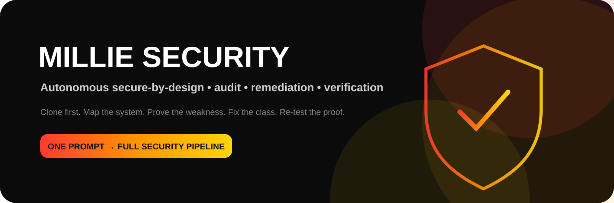
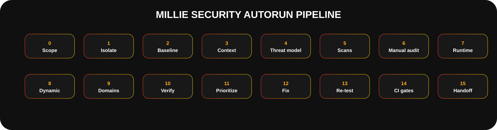
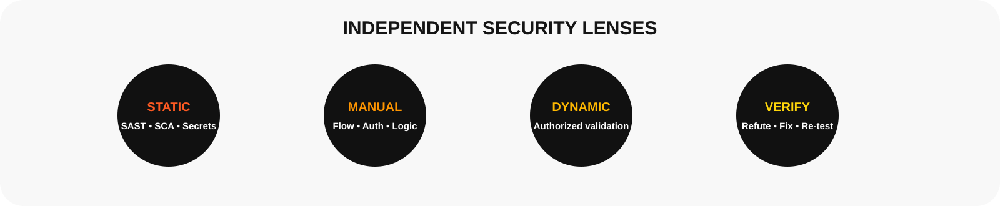

<div align="center">


<br /><br />



<br /><br />

# Millie Security v1.0

### Autonomous secure-by-design, AppSec audit, authorized validation, remediation and verification for AI coding agents.

**One instruction starts the complete applicable security pipeline.**

<br />

[**Install**](#installation) ·
[**Pipeline**](#the-autonomous-security-pipeline) ·
[**Coverage**](#security-coverage) ·
[**Strix**](#strix-integration) ·
[**Tools**](#tool-routing) ·
[**Research**](./RESEARCH_REPORT.md) ·
[**Assets**](./assets/)

</div>

---

# What is Millie Security?

`millie-sec` is a portable Agent Skill for securing **new and existing software projects**.

It combines the roles of:

```text
Application-security engineer
Secure-software architect
Threat modeler
Code auditor
Static-analysis reviewer
Dependency / supply-chain reviewer
Secrets reviewer
Authorized penetration tester
API / web security reviewer
Mobile security reviewer
Cloud / IaC security reviewer
AI / agent security reviewer
Security remediation engineer
Security test engineer
DevSecOps reviewer
Security documentation / evidence engineer
```

The purpose is not to run as many scanners as possible.

The purpose is to build the strongest practical evidence that the software has been:

```text
understood
    ↓
threat modeled
    ↓
tested from multiple independent angles
    ↓
remediated at the root cause
    ↓
re-tested
    ↓
given durable security guardrails
    ↓
handed back with honest residual risk
```

---

# One Prompt Starts Everything

The user should not need to say:

```text
clone the repo
run SAST
run dependency scanning
scan secrets
make a threat model
check authorization
test APIs
run Strix
fix findings
write tests
run the scanner again
add security to CI
write reports
```

Instead:

```text
Use millie-sec to secure this project.
```

is the trigger.

Millie Security then determines what applies and executes the entire safe/authorized pipeline.

For a local project supplied by the user, Millie proceeds automatically.

It interrupts only when information cannot safely be inferred, for example:

- permission to test external/third-party infrastructure;
- credentials or isolated test accounts needed for an authorized protected flow;
- an irreversible production operation;
- a business security requirement that cannot be derived from the project.

---

# Important Assurance Rule

Millie Security is designed for **maximum practical assurance**, not impossible guarantees.

It must never finish with claims such as:

```text
100% secure
completely secure
zero vulnerabilities
unhackable
```

A clean scan means:

> no finding was observed within that tested coverage.

It does **not** prove that no vulnerability exists.

Millie's final verdict is one of:

```text
SECURITY GATE: PASS

SECURITY GATE: PASS WITH RESIDUAL RISK

SECURITY GATE: FAIL
```

and is accompanied by:

```text
coverage
evidence
untested areas
blocked areas
remaining findings
assumptions
residual risk
```

---

# Existing Projects Are Never Repaired In Place

For an existing project, Millie Security defaults to:

```text
my-project/
my-project__millie-sec/
```

The original project remains the reference copy.

Preferred isolation:

```text
independent Git clone
      ↓
independent filesystem copy
      ↓
worktree only when deliberately chosen
```

For a local Git repository, Millie's workspace helper uses the equivalent of:

```bash
git clone --no-hardlinks <source> <secured-workspace>
```

It also attempts to preserve legitimate tracked staged/unstaged changes and safe non-ignored
untracked work.

Ignored files are **not copied by default** because they commonly contain:

```text
.env
credentials
local databases
build output
caches
node_modules
private keys
machine-local state
```

Accidental pushes from the security clone are disabled.

The user receives the **secured clone**.

The original repository is not modified unless the user separately requests a merge-back.

---

# Repository Trust Comes Before `npm install`

An important Millie Security rule is:

> A repository is not trusted merely because the user asked you to audit it.

Before executing setup/build/test hooks, Millie inspects potential executable behavior:

```text
package lifecycle scripts
preinstall / install / postinstall
shell bootstrap
Makefiles / task runners
Docker entrypoints
CI workflows
Git hooks
dev-container scripts
agent instructions
MCP/tool configuration
binary downloaders
curl | shell patterns
remote PowerShell execution
symlinks
unexpected credential access
```

The project can be classified:

```text
TRUSTED
CONSTRAINED
UNTRUSTED
UNKNOWN
```

Unknown/untrusted code should be run only in an appropriately isolated environment.

This protects the security agent itself from the code it is inspecting.

---

# The Autonomous Security Pipeline



Millie Security uses a 16-phase pipeline.

```text
 0  Authorization + target classification
 1  Isolation / clone / repository trust gate
 2  Inventory + build/test baseline
 3  Security context + assets + data + trust boundaries
 4  Threat model + abuse cases + control requirements
 5  Tool routing + coverage plan
 6  SAST / dependency / secrets / IaC / supply-chain scans
 7  Manual code audit + data flow + variant analysis
 8  Isolated runtime preparation
 9  Authorized dynamic / adversarial validation
10  Domain-specific security passes
11  Finding normalization + independent verification
12  Root-cause remediation + security regression tests
13  Proof replay + focused re-test + full regression + re-scan
14  Secure defaults + CI/CD + SBOM / provenance / monitoring gates
15  Final evidence + residual risk + secured-project handoff
```

Detailed state machine:

[**`references/pipeline.md`**](./references/pipeline.md)

---

# Phase 0 — Authorization and Scope

Millie first classifies the target.

Examples:

```text
local source supplied by user
owned local application
owned staging
production
external / third-party target
cloud account
mobile application
AI agent system
```

Local source security review can normally proceed.

Dynamic/intrusive testing of unrelated or external infrastructure requires explicit authorization.

Millie records:

```text
in-scope targets
excluded targets
allowed environment
test accounts
data restrictions
destructive-test restrictions
```

---

# Phase 1 — Clone and Trust Gate

 **Clone first.**

Millie:

1. records Git state;
2. creates an independent workspace;
3. reproduces legitimate dirty tracked state;
4. copies safe non-ignored untracked files where appropriate;
5. avoids ignored/secret-like files;
6. disables pushes;
7. inspects executable setup before running project code.

Helper:

```bash
python scripts/init_workspace.py /path/to/project
```

This helper **does not execute the target project**.

---

# Phase 2 — Baseline

Millie identifies:

```text
languages
frameworks
package managers
lockfiles
services / workspaces
tests
build commands
databases
authentication
authorization
containers
IaC
CI/CD
mobile
AI / RAG / agents
public interfaces
```

Read-only helper:

```bash
python scripts/inventory.py /path/to/project -o inventory.json
```

Only after the trust gate does Millie establish the real:

```text
build baseline
test baseline
lint/type baseline
runtime baseline
```

Pre-existing failures are recorded so security work is not blamed for them.

---

# Phase 3 — Security Context

Before vulnerability hunting, Millie builds a security model of the actual system.

It identifies:

```text
actors
roles
tenants
privileged users
sensitive assets
sensitive data
external interfaces
admin flows
data stores
service identities
trust boundaries
data flows
upload/parser paths
outbound network paths
CI/build identities
AI tool boundaries
```

This is based on the principle:

```text
UNDERSTAND FIRST
      ↓
HUNT SECOND
```

because a scanner finding has little value if the agent does not understand whether the path is
reachable or what security property it violates.

---

# Phase 4 — Threat Model

Millie builds product-specific abuse cases.

Typical threat categories include:

```text
identity spoofing
authentication failure
authorization bypass
cross-tenant access
sensitive data disclosure
tampering
injection
unsafe parsing
file abuse
SSRF / internal network access
business-flow abuse
replay
race conditions
resource exhaustion
supply-chain compromise
CI/release compromise
cloud privilege escalation
AI prompt/tool misuse
```

Security assumptions are documented explicitly.

Bad assumption:

```text
Only admins know the URL.
```

Better security property:

```text
Every privileged operation performs server-side role authorization,
and a non-admin regression test proves denial.
```

---

# Phase 5 — Coverage Plan

Millie does not silently omit domains.

It creates a coverage ledger.

Example:

```json
{
  "domain": "dependency-risk",
  "applicable": true,
  "method": [
    "osv-scanner",
    "manual-lockfile-review"
  ],
  "status": "planned",
  "limitations": []
}
```

Every applicable domain ends as:

```text
covered
partially-covered
blocked
not-tested
not-applicable
```

This is important because:

```text
tool unavailable
```

must not become:

```text
security check silently skipped
```

---

# Phase 6 — Automated Security Passes



Millie can route applicable automated coverage for:

```text
SAST
semantic data flow
dependencies / SCA
secrets
SBOM
licenses
containers
IaC
Kubernetes
CI workflows
language-native security checks
```

Automated findings are **candidates**.

They are not automatically accepted as vulnerabilities.

---

# Phase 7 — Manual Security Audit

Automation is not enough.

Millie manually reasons through security-sensitive paths such as:

```text
untrusted input
      ↓
validation
      ↓
authorization
      ↓
transformation
      ↓
security-sensitive sink
```

and:

```text
authenticated identity
      ↓
tenant / object selection
      ↓
authorization policy
      ↓
database query
```

and:

```text
user-controlled URL
      ↓
URL parser
      ↓
DNS resolution
      ↓
redirect
      ↓
network destination
```

and:

```text
uploaded file
      ↓
validation
      ↓
storage
      ↓
parser / converter
      ↓
download / rendering
```

This catches architectural and business-logic problems that pattern scanners may not understand.

---

# Variant Analysis

A confirmed security issue may represent a **vulnerability family**.

Example:

```text
one broken object authorization check
```

may imply:

```text
multiple handlers
multiple object types
batch endpoint
export endpoint
GraphQL resolver
background worker
mobile API variant
admin API variant
```

Millie therefore performs root-cause-based variant analysis.

Workflow:

```text
known issue
   ↓
extract root cause
   ↓
exact pattern matches known instance
   ↓
generalize one dimension
   ↓
review matches
   ↓
repeat
```

This avoids fixing one endpoint while leaving the same bug in five others.

---

# Phase 8 — Isolated Runtime

Dynamic testing should use:

```text
test database
synthetic data
test accounts
local containers
isolated credentials
owned staging
restricted network when practical
```

Production data is not the default test fixture.

---

# Phase 9 — Authorized Dynamic Validation

Millie uses dynamic validation only where it is:

```text
local
owned
or explicitly authorized
```

Potential approaches include:

```text
existing integration tests
framework test client
targeted HTTP/API tests
Strix
ZAP-class DAST
mobile dynamic tooling
safe fuzz/property testing
```

The goal is to **prove or disprove security properties** without turning the pipeline into
indiscriminate destructive testing.

---

# Strix Integration


Strix is one of Millie Security's highest-weight research/tool integrations.

It is particularly valuable because its security workflows emphasize:

```text
dynamic testing
validated findings
reproduction / proof
root-cause remediation
re-testing
CI integration
```

Millie uses Strix as an optional specialist engine—not as the entire security methodology.

## Preferred target

```text
the Millie security clone
        ↓
isolated local application
        ↓
synthetic/test accounts/data
```

An owned staging URL can also be used when appropriate.

---

## Strix finding lifecycle

```text
Strix finding
      ↓
read affected code + proof
      ↓
safely reproduce
      ↓
confirm impact
      ↓
find root cause
      ↓
search variants
      ↓
fix
      ↓
add regression
      ↓
replay original proof
      ↓
re-run relevant Strix scope
```

---

## Important Strix completion rule

Millie does **not** treat:

```text
process exit code = 0
```

as:

```text
full security coverage completed
```

It checks run metadata/coverage and records partial execution, budget exhaustion, unreachable
targets, missing auth, or incomplete exploration.

A partial run can still contain valid findings.

It simply cannot support a "clean dynamic scan" claim.

Detailed integration:

[**`references/strix.md`**](./references/strix.md)

---

# Phase 10 — Domain Security Passes

Millie dynamically loads only the security references relevant to the detected system.

---

## Authentication / Sessions / Authorization


Coverage includes:

```text
password handling
MFA / recovery
OAuth / OIDC
PKCE
JWT validation
session rotation
expiry
revocation
CSRF
login enumeration
service identity
object authorization
function authorization
field/property authorization
tenant isolation
admin boundaries
```

The frontend hiding a control is never considered authorization.

[**Auth & Access**](./references/auth-access.md)

---

## Input / Output / Injection


Coverage includes:

```text
SQL
NoSQL
command/process execution
XSS
template/expression injection
unsafe HTML
unsafe redirects
path handling
XML
structured parsers
deserialization
header/log/output sinks
```

Millie fixes the sink/control, not a single malicious string.

[**Input & Output**](./references/input-output.md)

---

## Secrets / Cryptography


Coverage includes:

```text
source secrets
Git history exposure
logs
frontend/mobile bundles
secret managers
rotation
TLS validation
password hashing
randomness
keys
nonces
signatures
token generation
```

A leaked live secret is not fixed merely by deleting it from the current file.

The response includes **rotation/revocation** when applicable.

[**Secrets & Crypto**](./references/secrets-crypto.md)

---

## Supply Chain


Coverage includes:

```text
manifests
lockfiles
transitive dependencies
vulnerability advisories
reachability
lifecycle scripts
dependency confusion
typosquatting indicators
SBOM
provenance
artifact signing
CI dependencies
```

Risk inputs can include:

```text
CISA KEV
EPSS
vendor advisory
actual reachability
project exposure
business impact
```

EPSS is an input—not Millie's whole project risk score.

[**Supply Chain**](./references/supply-chain.md)

---

## Web


Coverage includes:

```text
session cookies
CSRF
CORS
XSS
CSP
clickjacking
redirects
security headers
cache behavior
websockets
sensitive browser/server boundaries
```

[**Web Security**](./references/web-security.md)

---

## API


Coverage includes:

```text
BOLA
broken authentication
property-level authorization
resource consumption
function-level authorization
sensitive business flows
SSRF
misconfiguration
API inventory/versioning
unsafe upstream API consumption
GraphQL / gRPC / webhooks
```

[**API Security**](./references/api-security.md)

---

## Business Logic


Coverage includes:

```text
state transition bypass
replay
race / TOCTOU
duplicate side effects
idempotency
pricing/value manipulation
coupon/reward abuse
quota bypass
workflow ordering
```

[**Business Logic & Abuse**](./references/business-logic.md)

---

## SSRF / Network


Coverage includes:

```text
URL parsing
destination allowlisting
DNS behavior
redirects
private/link-local ranges
metadata services
egress controls
response size/time limits
```

[**SSRF / Network**](./references/network-ssrf.md)

---

## Files / Uploads / Parsers


Coverage includes:

```text
extension/MIME spoofing
archive traversal
zip-slip
decompression bombs
symlinks
XML
unsafe deserialization
image/document parsing
download behavior
storage isolation
```

[**Files & Parsers**](./references/files-parsers.md)

---

## Database / Storage


Coverage includes:

```text
parameterization
tenant query scoping
row-level security
database constraints
DB identities
sensitive storage
backups
migrations
secondary stores / cache
```

[**Database & Storage**](./references/database-storage.md)

---

## Cloud / IaC / Containers / Kubernetes


Coverage includes:

```text
IAM
public exposure
network boundaries
object storage
cloud secrets
KMS
containers
non-root
privileged mode
Docker socket
Kubernetes RBAC
security contexts
network policies
IaC
CI → cloud trust
```

[**Cloud / IaC / Containers**](./references/cloud-iac-containers.md)

---

## Mobile


Mobile work is based on MASVS/MASTG/MASWE-style coverage.

Areas:

```text
storage
crypto
auth
network
platform
code
resilience
privacy
deep links
WebViews
exported components
mobile API boundaries
```

Optional tooling can include MobSF/Frida-class inspection in an authorized test environment.

[**Mobile Security**](./references/mobile-security.md)

---

## AI / Agentic Systems


Coverage includes:

```text
prompt injection
untrusted web/RAG content
tool authorization
excessive agency
data exfiltration
unsafe model output
RAG poisoning
tenant-aware retrieval
secret/system prompt leakage
unbounded tool/model usage
agent identity/delegation
```

Critical rule:

> The model is not the authorization boundary.

Tool/server permissions must enforce real security.

[**AI & Agent Security**](./references/ai-agent-security.md)

---

## Privacy / Logging / Failure Paths


Coverage includes:

```text
data minimization
PII/sensitive logging
token redaction
audit events
retention
exception leakage
default-allow error paths
partial transaction failure
retry duplication
alerting
```

[**Privacy, Logging & Errors**](./references/privacy-logging-errors.md)

---

# Tool Routing

Millie Security contains a machine-readable registry of **40 security tool routes**.

[**`data/tool-registry.json`**](./data/tool-registry.json)

It knows when tools such as these may be useful:

<table>
<tr>
<td align="center"></td>
<td align="center"></td>
<td align="center"></td>
</tr>
<tr>
<td align="center"></td>
<td align="center"></td>
<td align="center"></td>
</tr>
</table>

And can route additional stack-specific tools for:

```text
Python
JavaScript / TypeScript
Go
Rust
Java / Kotlin
Ruby
PHP
.NET
Swift
mobile
Docker
Terraform
Kubernetes
native code
```

---

## Tool Count Is Not a Score

Millie deliberately rejects:

```text
install 50 tools
run all 50
green = secure
```

Instead:

```text
detect project
      ↓
identify security domains
      ↓
choose smallest high-value independent tool set
      ↓
run
      ↓
reason over results
```

Three similar regex scanners do not equal three independent security opinions.

---

## Tool Plan Helper

After inventory:

```bash
python scripts/tool_router.py inventory.json
```

The router creates a **plan only**.

It does not mass-install tools or launch dynamic attacks.

---

# Phase 11 — Finding Verification


Millie normalizes candidate findings into:

```text
CONFIRMED
HIGH-CONFIDENCE
PLAUSIBLE
UNVERIFIED
FALSE-POSITIVE
NOT-APPLICABLE
FIXED
ACCEPTED
```

For high/critical candidates it uses multiple independent lenses when practical.

```text
Lens A
code / data-flow evidence

Lens B
safe runtime / reproduction evidence

Lens C
refutation
"What would make this finding false?"
```

This is deliberately adversarial.

Millie should try to **disprove** a serious candidate before declaring it real.

---

# False Positives Are Evidence Decisions

Bad:

```text
The scanner says HIGH, so it must be real.
```

Also bad:

```text
The developer says it's unreachable, so suppress it.
```

Better:

```text
trace source
trace control
trace sink
check configuration
check reachability
test safely if useful
classify
document evidence
```

Suppressions require a documented reason and evidence.

---

# Phase 12 — Root-Cause Remediation

A security fix should remove the violated security property—not only the demonstration.

---

## Broken access control

Bad:

```text
hide the button
block one object ID
special-case the test
```

Better:

```text
central server-side authorization
trusted tenant context
query-level ownership / tenant scoping
negative tests
```

---

## Injection

Bad:

```text
block one dangerous substring
```

Better:

```text
parameterization
context-aware encoding
safe process API
remove unnecessary interpreter
```

---

## SSRF

Bad:

```text
if url contains "localhost": reject
```

Better:

```text
avoid arbitrary destination
or
strict destination policy
+
correct URL parsing
+
resolved address validation
+
redirect checks
+
egress controls
```

---

## Secret leak

Bad:

```text
delete the API key from source
```

Better:

```text
revoke / rotate
      +
remove exposure
      +
move to secret manager
      +
consider history/artifacts
      +
add secret scanning
```

---

# Security Regression Tests

Every confirmed security fix gets durable regression coverage when practical.

Examples:

```text
wrong tenant cannot read object
wrong role cannot invoke admin action
revoked session is rejected
unsafe input cannot reach SQL/shell/template sink
SSRF cannot reach forbidden internal destination
archive cannot escape extraction root
upload validation survives MIME/name spoofing
security error does not leak internals
rate/resource limit remains bounded
secret redaction remains active
```

Security tests turn a one-time patch into a guardrail.

---

# Phase 13 — Prove the Fix

For each serious confirmed finding:

```text
run focused regression
      ↓
replay original safe proof
      ↓
verify defensive failure
      ↓
re-run relevant scanner
      ↓
variant search
      ↓
broader tests/build/scans
```

Important:

```text
server crashes now
```

is not a security fix merely because:

```text
exploit no longer returns sensitive data
```

The failure must occur for the intended security reason.

---

# Risk Prioritization

Millie does not blindly use scanner severity.

It considers:

```text
technical impact
proof / reproduction
exposure
reachability
authentication requirement
privilege gain
tenant crossing
sensitive data
asset criticality
dependency reachability
known exploitation
exploit likelihood
confidence
compensating controls
```

---

## Millie Priority Score

A transparent project-priority helper:

```text
Technical impact               0–25
Exploit / reproduction         0–20
Exposure / reachability        0–15
Privilege / tenant crossing    0–15
Sensitive data / business      0–10
Known exploitation / KEV       0–8
Exploit likelihood / EPSS      0–4
Confidence                     0–3
                              ----
                               100
```

Priority classes:

```text
P0 — immediate / block release
P1 — urgent / before release
P2 — near-term
P3 — hardening / backlog
P4 — informational
```

The score is a Millie prioritization helper.

It is **not** a replacement for CVSS, EPSS or a formal organizational risk model.

Helper:

```bash
python scripts/risk_score.py risk-input.json
```

---

# Phase 14 — Continuous Security

The final project should be harder to regress.

Applicable CI controls can include:

```text
secret scanning
diff-aware SAST
dependency / SCA
security regression tests
IaC scanning
container scanning
SBOM generation
dynamic diff/PR testing
release provenance/signing
scheduled deeper security pass
```

Not every project needs every gate.

Millie adds the controls that fit.

---

# CI Must Not Fail Open by Accident

A security job can look impressive while doing nothing if configured like:

```text
scanner fails
      ↓
continue-on-error
      ↓
pipeline stays green
```

Millie checks whether the security control is:

```text
advisory
merge-blocking
release-blocking
```

and keeps that behavior explicit.

---

# SBOM and Supply-Chain Handoff

When applicable Millie can produce:

```text
CycloneDX / SPDX SBOM
dependency vulnerability evidence
image scan
provenance/signing posture
release dependency inventory
```

Artifact paths live under:

```text
docs/millie-security/artifacts/
```

when suitable for the project.

Do not commit secret-bearing raw tool output to public repositories.

---

# Phase 15 — Security Documentation

Millie maintains durable project security knowledge.

Default structure:

```text
docs/millie-security/
├── PROJECT_SECURITY_MAP.md
├── THREAT_MODEL.md
├── ATTACK_SURFACE.md
├── CONTROL_MATRIX.md
├── BASELINE_REPORT.md
├── FINDINGS.md
├── REMEDIATION_LOG.md
├── VERIFICATION_REPORT.md
├── RESIDUAL_RISK.md
├── SECURITY_CHANGELOG.md
│
├── graphs/
│   ├── attack-surface.json
│   ├── trust-boundaries.json
│   ├── data-flow.json
│   └── authz-matrix.json
│
├── artifacts/
│   ├── sbom.cdx.json
│   ├── findings.sarif
│   └── tool-results/
│
└── memory/
    ├── core.md
    ├── auth-model.md
    ├── data-classification.md
    ├── security-assumptions.md
    ├── known-risks.md
    └── commands.md
```

Only relevant artifacts are created.

A simple project should not get meaningless empty compliance files just to make the folder look
complete.

---

# Durable Security Memory

Security context should not disappear when the chat resets.

Millie's project memory can retain:

```text
auth model
tenant model
sensitive data classification
security assumptions
critical modules
known residual risks
verification commands
important trust boundaries
```

It must **not** retain:

```text
passwords
API tokens
private keys
production customer data
full credential-bearing requests
```

---

# Standards and Frameworks

Millie Security routes applicable coverage to established standards.

## OWASP Application Security Verification Standard

Primary detailed application-control reference:

```text
OWASP ASVS 5.0
```

---

## OWASP Top 10

Broad web-risk awareness:

```text
OWASP Top 10:2025
```

---

## OWASP WSTG

Authorized web testing methodology.

---

## OWASP API Security

```text
OWASP API Security Top 10 2023
```

particularly useful for authorization-heavy API coverage.

---

## OWASP Mobile

```text
MASVS
MASTG
MASWE
```

---

## OWASP GenAI / Agentic AI

Used when the project includes:

```text
LLMs
RAG
agents
tools
model-driven automation
```

---

## NIST SSDF

Used for secure-development lifecycle reasoning.

---

## CWE

Used as a weakness taxonomy and common-weakness coverage reference.

---

## OpenSSF / SLSA / SBOM

Used for supply-chain and release integrity.

---

# Security Coverage

Millie v1 includes dedicated references for:

<table>
<tr>
<td> Authentication / sessions</td>
<td> Authorization / tenancy</td>
<td> Injection / output</td>
</tr>
<tr>
<td> Secrets / crypto</td>
<td> Supply chain</td>
<td> Web</td>
</tr>
<tr>
<td> APIs</td>
<td> Business logic</td>
<td> SSRF / egress</td>
</tr>
<tr>
<td> Files / parsers</td>
<td> Database / storage</td>
<td> Cloud / IaC</td>
</tr>
<tr>
<td> Containers / K8s</td>
<td> Mobile</td>
<td> AI / agents</td>
</tr>
<tr>
<td> Privacy / logging</td>
<td> CI / release</td>
<td> Verification</td>
</tr>
</table>

---

# New Projects

Millie Security is not only a scanner for finished code.

If invoked while building a new project:

```text
Use millie-sec while creating this application.
```

it enters **secure-by-design mode**.

Before release it establishes:

```text
threat model
data classification
auth architecture
authorization / tenant model
secrets strategy
dependency policy
secure error behavior
logging/redaction
resource/abuse controls
negative security tests
SAST/SCA/secrets
CI security gates
```

Detailed workflow:

[**`workflows/new-project.md`**](./workflows/new-project.md)

---

# Existing Projects

Existing projects use the full clone-first hardening flow.

[**`workflows/existing-project.md`**](./workflows/existing-project.md)

The secured output remains separated until the user decides what to merge.

---

# Specialized Workflows

```text
workflows/
├── existing-project.md
├── new-project.md
├── web-api.md
├── mobile.md
├── cloud-infra.md
├── ai-agent.md
└── ci-cd.md
```

---

# Security Tool Registry

The registry currently contains **40 routing entries**, including general and language-specific
security tooling.

Categories include:

```text
SAST
semantic data flow
SCA
secrets
SBOM
container
IaC
Kubernetes
web/API DAST
mobile
supply chain
fuzzing
native sanitizers
```

Browse:

[**Tool Registry**](./data/tool-registry.json)

---

# Safe Helper Scripts

```text
scripts/
├── init_workspace.py
├── inventory.py
├── coverage_init.py
├── tool_router.py
├── normalize_findings.py
├── risk_score.py
├── security_gate.py
└── validate.py
```

---

## `init_workspace.py`

Creates the isolated security clone/copy.

```bash
python scripts/init_workspace.py /path/to/project
```

Does not execute the project.

---

## `inventory.py`

Read-only stack/security-surface index.

```bash
python scripts/inventory.py ./project -o inventory.json
```

---

## `coverage_init.py`

Create initial domain ledger:

```bash
python scripts/coverage_init.py inventory.json > coverage.json
```

---

## `tool_router.py`

Create the minimal useful tool plan:

```bash
python scripts/tool_router.py inventory.json
```

---

## `normalize_findings.py`

Normalizes selected:

```text
SARIF
Semgrep JSON
Trivy JSON
Gitleaks JSON
```

into Millie's finding shape.

```bash
python scripts/normalize_findings.py results.sarif -o findings.json
```

Secret-like fields are redacted.

---

## `risk_score.py`

```bash
python scripts/risk_score.py risk-input.json
```

---

## `security_gate.py`

```bash
python scripts/security_gate.py findings.json --coverage coverage.json
```

Outputs:

```text
SECURITY GATE: PASS
PASS WITH RESIDUAL RISK
or
FAIL
```

plus the reasons.

---

## `validate.py`

Validates the skill package itself:

```bash
python scripts/validate.py .
```

---

# Schemas

```text
schemas/
├── finding.schema.json
├── coverage.schema.json
├── attack-surface.schema.json
└── control-evidence.schema.json
```

These make Millie's handoff artifacts easier for agents/tools to exchange consistently.

---

# Finding Severity ≠ Finding Truth

Millie separates:

```text
severity
```

from:

```text
confidence
```

and from:

```text
project priority
```

For example:

```text
scanner severity: CRITICAL
confidence: UNVERIFIED
project reachability: none
```

requires investigation.

While:

```text
scanner severity: HIGH
confidence: CONFIRMED
cross-tenant data access: YES
internet exposed: YES
```

may be a release-blocking P0/P1 even without a "critical" label.

---

# Independent Security Lenses

Millie deliberately combines complementary methods:

```text
STATIC
SAST • SCA • secrets • IaC

MANUAL
architecture • trust • auth • business logic • data flow

DYNAMIC
local / owned / authorized validation

VERIFY
independent refutation • root fix • replay • regression
```

The goal is not consensus between tools.

The goal is evidence about the actual system.

---

# Research Filtering

You may recognize Millie Security as part of a broader Millie research program containing UI/UX,
animation, 3D, agent and development resources.

Millie **does not import everything into every skill**.

For Security, sources are weighted by relevance.

---

## Highest Weight — 10/10

```text
Strix
Trail of Bits security skills
OWASP security standards / testing projects
```

These directly influence core application-security methodology.

---

## 9–9.5/10

```text
Anthropic Claude Security workflows
Semgrep security skills
```

Used for independent verification, patch isolation, SAST/taint and secure coding.

---

## 8–8.5/10

```text
NIST SSDF
OpenSSF / SLSA / SBOM ecosystem
Security Engineer / Security Developer subsets of the large Antigravity skills collection
backend / auth / API security skills
Superpowers evidence / TDD discipline
```

---

## 6–7.5/10

```text
gstack adversarial review
Ruflo optional multi-agent orchestration
```

They improve process/orchestration rather than defining core vulnerability knowledge.

---

## Intentionally Excluded From Security Core

These are strong resources in other Millie skills, but adding them to `millie-sec` would make the
security skill worse:

```text
GSAP
Refero visual styles
ThreeUI
img2three.js
React Native Reanimated
Stitch UI
Taste
Awesome Claude Design
Design.md visual tools
Unlumen
Smooth UI
AnimMaster
Threlte
PeachWeb
Theatre.js
Spline
```

They belong primarily to UI/motion/3D workflows.

`shadcn/ui`, UI/UX Pro, Impeccable and Agentation receive only tiny/incidental security weight.

Complete rationale:

[**Resource Weights**](./references/resource-weights.md)

Machine-readable:

[**`data/source-weights.json`**](./data/source-weights.json)

---

# Why the 1,400+ Skill Repository Is Filtered

A repository containing 1,000+ skills should not be loaded wholesale into one agent skill.

Millie Security only uses relevant portions such as:

```text
Security Engineer
Security Developer
API security
auth implementation
backend security
cloud security
security auditing
vulnerability analysis
```

The UI, SEO, design, marketing, animation and unrelated engineering skills do not belong in the
Security context.

This improves:

```text
precision
context efficiency
instruction consistency
security depth
```

---

# Superpowers Influence

Superpowers contributes process ideas rather than vulnerability knowledge:

```text
test before claim
systematic debugging
evidence before completion
independent review
small verified steps
```

Millie adapts these ideas to security.

It does **not** make every two-line fix run a huge ceremony.

---

# gstack Influence

gstack's useful security contribution is an **adversarial second-opinion pattern**.

Millie incorporates the idea as:

```text
primary security analysis
        ↓
independent challenge / refutation
        ↓
evidence reconciliation
```

A second agent can be used where the environment supports it, but it is not required.

---

# Ruflo Influence

Ruflo is treated as optional orchestration.

For an unusually large project, if multi-agent infrastructure exists, Millie can conceptually
separate:

```text
security context agent
SAST / variant agent
auth/API agent
supply-chain agent
dynamic-validation agent
cloud/mobile/AI specialist
remediation agent
independent verifier
```

But ordinary usage remains:

```text
one coding agent
+
millie-sec
```

Ruflo is never a required dependency.

---

# Security Standards Are Coverage, Not Certificates

Using ASVS does not automatically mean:

```text
ASVS compliant
```

Running an OWASP-aligned scanner does not automatically mean:

```text
OWASP verified
```

Millie records:

```text
control
applicability
implementation
test/evidence
status
gap
```

and only claims what was actually assessed.

---

# Pressure Tests for Millie Itself

Millie Security ships **17 evaluation cases**.

Examples include:

```text
dirty repository isolation
malicious package lifecycle hook
cross-tenant IDOR
injection family
SSRF
committed live secret
critical vulnerable dependency
cloud/IaC exposure
mobile plaintext storage
AI tool prompt injection
business race condition
Strix partial scan
no security tools installed
unauthorized third-party target
new secure project
scanner false positive
absolute-security wording
```

Browse:

[**`evaluations/cases.json`**](./evaluations/cases.json)

These cases test whether an agent follows the skill correctly.

They do not imply that every supported AI coding agent has already passed every behavioral case.

---

# The Completion Gate

Millie Security is not done until the applicable conditions are satisfied.

- [ ] Existing project is isolated
- [ ] Original project remains untouched
- [ ] Repository trust gate ran before executable setup
- [ ] Baseline is recorded
- [ ] Attack surface is mapped
- [ ] Sensitive data/assets are mapped
- [ ] Trust boundaries are documented
- [ ] Threat model exists
- [ ] Authorization/tenant boundaries were reviewed where applicable
- [ ] Relevant static analysis ran or gap is recorded
- [ ] Dependencies were reviewed
- [ ] Secrets were reviewed
- [ ] IaC/container/mobile/AI domains were routed if present
- [ ] Dynamic validation ran where useful/authorized or gap is recorded
- [ ] Serious findings were independently verified
- [ ] Confirmed critical/high findings were fixed or explicitly blocked
- [ ] Variants were searched
- [ ] Security regression tests were added when practical
- [ ] Original proof/reproduction was re-tested
- [ ] Relevant scanners were re-run
- [ ] Full regression/build passed or known baseline failures are documented
- [ ] CI/security guardrails were added where appropriate
- [ ] Residual risk is explicit
- [ ] Coverage gaps are explicit
- [ ] Final gate verdict is evidence-based
- [ ] No absolute security claim is made

---

# Installation

Millie Security is designed to install through the main Millie installer.

## PowerShell

```powershell
irm https://raw.githubusercontent.com/cassielxyz/millieskills/main/millie-installer/install.ps1 | iex
```

Select:

```text
Millie Security
```

and then your coding agent.

> `millie-sec` must be marked `available` in `millie-installer/skills.json` before it appears as an
> installable released skill.

This package includes:

```text
integration/skills-manifest-entry.json
```

with the manifest entry to merge.

---

# Manual Installation

Keep the **whole `millie-sec/` directory** together.

Do not install only `SKILL.md`.

---

## Claude Code

```text
~/.claude/skills/millie-sec/
```

---

## Google Antigravity IDE

```text
~/.gemini/config/skills/millie-sec/
```

---

## Antigravity CLI

```text
~/.gemini/antigravity-cli/skills/millie-sec/
```

---

## VS Code / GitHub Copilot

```text
~/.copilot/skills/millie-sec/
```

---

## Cursor

```text
~/.cursor/skills/millie-sec/
```

---

## OpenAI Codex

```text
~/.agents/skills/millie-sec/
```

---

## Gemini CLI

```text
~/.gemini/skills/millie-sec/
```

---

# Usage

The recommended prompt is intentionally short.

```text
Use millie-sec to secure this project.
```

That is enough.

---

## Existing Project

```text
Use millie-sec.

Run the complete security pipeline and give me the secured project.
```

Millie should infer the rest.

---

## New Project

```text
Use millie-sec while building this project.
```

Millie should apply secure-by-design gates from the start.

---

## API

```text
Use millie-sec to secure this API.
```

Millie automatically includes API/auth/business-logic coverage.

---

## Mobile

```text
Use millie-sec to secure this mobile app.
```

Millie routes MASVS/MASTG-style coverage and server/API boundaries.

---

## AI Agent

```text
Use millie-sec to secure this AI agent project.
```

Millie routes prompt/tool/RAG/agency/data-exfiltration coverage.

---

# What You Should Not Need to Say

You should **not** have to write:

```text
run Semgrep
now run Gitleaks
now check dependencies
now threat model
now run Strix
now check IDOR
now fix it
now test it
now write a report
```

The skill exists specifically to remove that manual orchestration.

---

# Package Structure

```text
millie-sec/
├── SKILL.md
├── README.md
├── VERSION
├── CHANGELOG.md
├── RESEARCH_REPORT.md
├── CHECKSUMS.sha256
│
├── references/
│   ├── pipeline.md
│   ├── isolation-trust.md
│   ├── context-threat-model.md
│   ├── standards-controls.md
│   ├── tool-routing.md
│   ├── strix.md
│   ├── sast-variant.md
│   ├── auth-access.md
│   ├── input-output.md
│   ├── secrets-crypto.md
│   ├── supply-chain.md
│   ├── web-security.md
│   ├── api-security.md
│   ├── business-logic.md
│   ├── network-ssrf.md
│   ├── files-parsers.md
│   ├── database-storage.md
│   ├── cloud-iac-containers.md
│   ├── mobile-security.md
│   ├── ai-agent-security.md
│   ├── privacy-logging-errors.md
│   ├── findings-verification.md
│   ├── risk-prioritization.md
│   ├── remediation-verification.md
│   ├── devsecops.md
│   ├── reporting-memory.md
│   ├── rationalizations.md
│   ├── resource-weights.md
│   └── source-index.md
│
├── workflows/
│   ├── new-project.md
│   ├── existing-project.md
│   ├── web-api.md
│   ├── mobile.md
│   ├── cloud-infra.md
│   ├── ai-agent.md
│   └── ci-cd.md
│
├── scripts/
│   ├── init_workspace.py
│   ├── inventory.py
│   ├── coverage_init.py
│   ├── tool_router.py
│   ├── normalize_findings.py
│   ├── risk_score.py
│   ├── security_gate.py
│   └── validate.py
│
├── data/
│   ├── tool-registry.json
│   ├── control-catalog.json
│   ├── source-weights.json
│   └── risk-model.json
│
├── schemas/
│   ├── finding.schema.json
│   ├── coverage.schema.json
│   ├── attack-surface.schema.json
│   └── control-evidence.schema.json
│
├── templates/
│   └── docs/
│       └── millie-security/
│           ├── PROJECT_SECURITY_MAP.md
│           ├── THREAT_MODEL.md
│           ├── ATTACK_SURFACE.md
│           ├── CONTROL_MATRIX.md
│           ├── BASELINE_REPORT.md
│           ├── FINDINGS.md
│           ├── REMEDIATION_LOG.md
│           ├── VERIFICATION_REPORT.md
│           ├── RESIDUAL_RISK.md
│           ├── SECURITY_CHANGELOG.md
│           ├── graphs/
│           ├── artifacts/
│           └── memory/
│
├── evaluations/
│   ├── README.md
│   └── cases.json
│
├── assets/
│   ├── brand/
│   ├── banners/
│   ├── icons/
│   ├── tools/
│   ├── README.md
│   └── THIRD_PARTY_NOTICES.md
│
└── integration/
    └── skills-manifest-entry.json
```

---

# Assets

Millie Security includes **original SVG documentation assets**.

Browse:

[**All assets**](./assets/)

[**Brand**](./assets/brand/)

[**Banners**](./assets/banners/)

[**Security icons**](./assets/icons/)

[**Neutral tool badges**](./assets/tools/)

Public GitHub path after publishing:

```text
https://github.com/cassielxyz/millieskills/tree/main/millie-sec/assets
```

The tool badges are neutral Millie-made text/initial graphics, **not official vendor logos**.

---

# Research

The complete research/filtering notes are in:

[**RESEARCH_REPORT.md**](./RESEARCH_REPORT.md)

and:

[**references/source-index.md**](./references/source-index.md)

The source weights are in:

[**references/resource-weights.md**](./references/resource-weights.md)

---

# Ethical / Authorized Security Use

Millie Security is intended for:

```text
software you own
software the user provided
local projects
owned staging
authorized security assessment
secure development
defensive review
```

It must not automatically launch intrusive testing against unrelated third-party infrastructure.

For external dynamic targets, authorization is part of the pipeline.

Source-code auditing, secure implementation and local project hardening can continue without
turning the work into an unauthorized network assessment.

---

# Final Handoff

A successful Millie Security run should leave the user with:

```text
secured project clone
      +
security map
      +
threat model
      +
attack surface
      +
normalized findings
      +
root-cause remediation log
      +
security regression tests
      +
verification evidence
      +
CI security controls
      +
residual risk report
      +
security gate verdict
```

not simply:

```text
scanner output
```

---

<div align="center">


<br /><br />


# Millie Security

### Assume nothing. Map the system. Prove the weakness. Fix the class. Re-test the proof. Keep the guardrail.

`millie-sec` · `v1.0.0`

[**SKILL.md**](./SKILL.md) ·
[**Pipeline**](./references/pipeline.md) ·
[**Research**](./RESEARCH_REPORT.md) ·
[**Assets**](./assets/)

</div>
