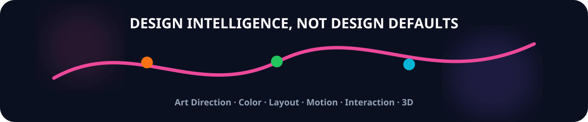
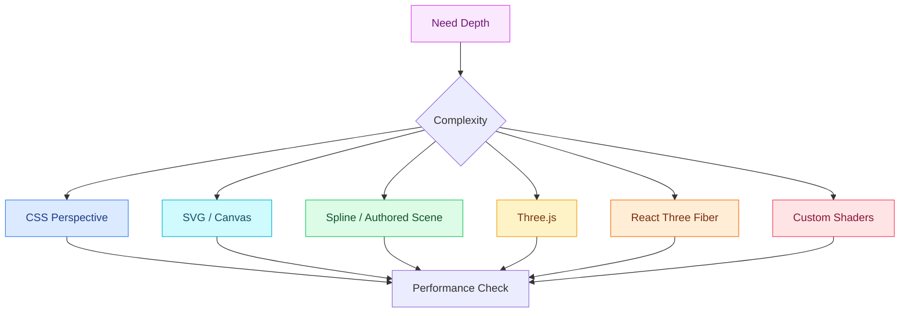
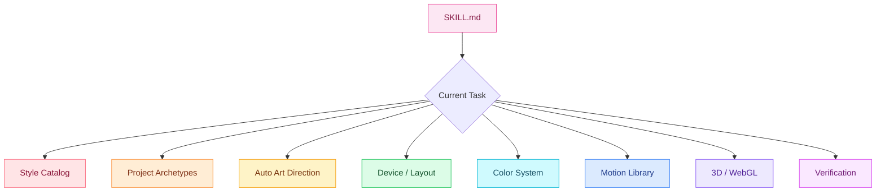
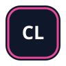
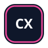

<div align="center">


<br />

# Millie UI/UX

### Design with taste. Build with intent.

A research-driven **UI/UX art-direction, frontend-design, motion and 3D skill** for AI coding agents.

<br />


<br /><br />



<br />

**One skill. Different products. Different identities.**

</div>

---

<table>
<tr>
<td width="25%" align="center">


### Art Direction

Context-aware visual direction instead of generic templates.

</td>

<td width="25%" align="center">


### Color Intelligence

Semantic palettes, OKLCH, contrast and theme generation.

</td>

<td width="25%" align="center">


### Motion

Microinteractions, transitions, scroll choreography and feedback.

</td>

<td width="25%" align="center">


### 3D / WebGL

Three.js, React Three Fiber, shaders and spatial experiences.

</td>
</tr>
</table>

---

##  What is Millie?

**Millie UI/UX** is a portable Agent Skill built to improve how AI coding agents design and implement interfaces.

Its purpose is not simply to generate prettier frontend code.

Millie gives an agent a repeatable design process for deciding:

* what an interface should feel like;
* how much visual expression the product can support;
* how layouts should change by screen and window size;
* which visual style fits the product;
* which color relationships fit the brand and context;
* what kind of typography should be used;
* when motion improves interaction;
* when animation becomes distracting;
* whether 3D actually contributes value;
* how to avoid repeating the same design across unrelated projects.

Millie is designed to fight the familiar output pattern of AI-generated interfaces:

```text
generic gradient
+
centered hero
+
rounded cards
+
random icons
+
glass panels
+
fade-up animation
=
"premium"
```

Millie replaces that with:

```text
product
+
audience
+
task
+
art direction
+
typography
+
semantic color
+
proportion
+
material
+
motion
+
responsive behavior
+
verification
=
designed product experience
```

---

##  How Millie Thinks



```mermaid
flowchart LR
    A["PRODUCT"] --> B["USERS"]
    B --> C["ART DIRECTION"]
    C --> D["DESIGN SYSTEM"]
    D --> E["LAYOUT"]
    E --> F["MOTION"]
    F --> G["RESPONSIVE"]
    G --> H["VERIFY"]
    H --> I["SHIP"]

    style A fill:#ffe4e6,stroke:#fb7185,color:#881337
    style B fill:#ffedd5,stroke:#fb923c,color:#7c2d12
    style C fill:#fef3c7,stroke:#f59e0b,color:#78350f
    style D fill:#dcfce7,stroke:#22c55e,color:#14532d
    style E fill:#cffafe,stroke:#06b6d4,color:#164e63
    style F fill:#dbeafe,stroke:#3b82f6,color:#1e3a8a
    style G fill:#e0e7ff,stroke:#6366f1,color:#312e81
    style H fill:#ede9fe,stroke:#8b5cf6,color:#4c1d95
    style I fill:#fce7f3,stroke:#ec4899,color:#831843
```

Millie does not begin with:

> Which Tailwind classes should I use?

It begins with:

> What design decisions make sense for this product?

---

#  Auto Premium Mode

If the user provides detailed design instructions, Millie follows them.

If the user gives **no meaningful visual direction**, Millie does not default to one canned theme.

Instead, it becomes the art director.

For example:

```text
Build a website for my architecture studio.
```

Millie internally evaluates:

```text
Product category
Audience
Trust requirements
Content density
Visual opportunity
Platform
Available assets
Expected interaction frequency
Performance budget
```

It then generates multiple candidate directions.

Example:

```text
Candidate A
Swiss editorial
Warm limestone palette
Asymmetric architecture grid
Grotesk typography
Blueprint-line transitions

Candidate B
Luxury minimal
Ivory + graphite
Large photography
High-contrast serif
Restrained image-mask movement

Candidate C
Spatial modern
Cool mineral palette
Layered depth
3D building model
Scroll-driven camera transitions
```

It chooses the strongest fit instead of asking the user to art-direct every decision.

---

#  Design Fingerprints

Millie gives each project a **Design Fingerprint**.

```yaml
primary_style:
secondary_influence:
composition_family:
type_character:
palette_family:
material_language:
motion_language:
signature_detail:
density:
theme_mode:
```

Example:

```yaml
primary_style: editorial-luxury
secondary_influence: swiss
composition_family: asymmetric-columns

type_character:
  display: high-contrast-serif
  utility: neutral-grotesk

palette_family:
  neutral: warm-ivory
  dark: espresso
  accent: oxblood

material_language: paper-and-ink
motion_language: editorial-mask
signature_detail: art-directed-image-cropping

density: relaxed
theme_mode: light
```

---

## Different Project, Different Identity

If one project uses:

```text
Dark theme
Glass panels
Geometric sans
Centered composition
Blue accent
Scroll reveal
```

Millie should not casually use the same combination again.

Another project might become:

```text
Light editorial theme
Cardless composition
Serif + grotesk pairing
Warm mineral palette
Asymmetric grid
Image mask transitions
```

Millie checks seven major axes:

<table>
<tr>
<td><strong>Style</strong></td>
<td><strong>Composition</strong></td>
<td><strong>Typography</strong></td>
<td><strong>Palette</strong></td>
<td><strong>Material</strong></td>
<td><strong>Motion</strong></td>
<td><strong>Signature</strong></td>
</tr>
</table>

If too many axes repeat without a genuine product reason, Millie changes the weakest one.

---

#  Visual Style Intelligence

Millie understands visual styles as **systems**, not Pinterest labels.

Every style has:

* suitable product categories;
* typography behavior;
* color behavior;
* spacing behavior;
* shape language;
* material treatment;
* motion pairing;
* accessibility risks;
* performance risks;
* implementation guidance.

---

## Refined Systems

<table>
<tr>
<th>Style</th>
<th>Visual Character</th>
<th>Strong Fits</th>
</tr>

<tr>
<td><strong>Refined Minimal</strong></td>
<td>Quiet, precise, disciplined</td>
<td>SaaS, B2B, architecture, productivity</td>
</tr>

<tr>
<td><strong>Luxury Minimal</strong></td>
<td>Restrained, material-aware, editorial</td>
<td>Fashion, beauty, hospitality, automotive</td>
</tr>

<tr>
<td><strong>Swiss</strong></td>
<td>Grid-driven, rational, asymmetric</td>
<td>Architecture, culture, studios</td>
</tr>

<tr>
<td><strong>Editorial</strong></td>
<td>Typography and imagery first</td>
<td>Publishing, portfolios, storytelling</td>
</tr>

<tr>
<td><strong>Monochrome Precision</strong></td>
<td>Minimal color, strong hierarchy</td>
<td>Developer tools, B2B, productivity</td>
</tr>
</table>

---

## Material Systems

<table>
<tr>
<th>Style</th>
<th>Visual Character</th>
<th>Strong Fits</th>
</tr>

<tr>
<td><strong>Glassmorphism</strong></td>
<td>Frosted translucent layering</td>
<td>Media, overlays, navigation, spatial UI</td>
</tr>

<tr>
<td><strong>Liquid Glass Inspired</strong></td>
<td>Adaptive, fluid foreground materials</td>
<td>Navigation, media controls, Apple-style native surfaces</td>
</tr>

<tr>
<td><strong>Neumorphism</strong></td>
<td>Soft molded surfaces</td>
<td>Audio controls, wellness, focused control clusters</td>
</tr>

<tr>
<td><strong>Claymorphism</strong></td>
<td>Inflated, friendly tactile geometry</td>
<td>Education, onboarding, playful consumer apps</td>
</tr>

<tr>
<td><strong>Modern Skeuomorphism</strong></td>
<td>Selective physical realism</td>
<td>Music, automotive, creative tools</td>
</tr>

<tr>
<td><strong>Chrome / Holographic</strong></td>
<td>Spectral reflective materials</td>
<td>Fashion, gaming, music, launches</td>
</tr>
</table>

---

## Graphic Systems

<table>
<tr>
<th>Style</th>
<th>Character</th>
<th>Strong Fits</th>
</tr>

<tr>
<td><strong>Neobrutalism</strong></td>
<td>Hard borders, graphic shadows</td>
<td>Creative startups, education, youth brands</td>
</tr>

<tr>
<td><strong>Brutalism</strong></td>
<td>Raw, exposed, deliberately unconventional</td>
<td>Culture, art, experimental portfolios</td>
</tr>

<tr>
<td><strong>Bauhaus</strong></td>
<td>Geometric, structural, bold</td>
<td>Events, design, architecture</td>
</tr>

<tr>
<td><strong>Maximalism</strong></td>
<td>Layered color, imagery and type</td>
<td>Music, entertainment, fashion</td>
</tr>

<tr>
<td><strong>Anti-Grid</strong></td>
<td>Intentional visual rule-breaking</td>
<td>Campaigns, agencies, portfolios</td>
</tr>
</table>

---

## Atmospheric Systems

<table>
<tr>
<th>Style</th>
<th>Character</th>
<th>Strong Fits</th>
</tr>

<tr>
<td><strong>Organic</strong></td>
<td>Natural, fluid, human</td>
<td>Wellness, sustainability, food</td>
</tr>

<tr>
<td><strong>Dark Cinematic</strong></td>
<td>Deep, atmospheric, image-led</td>
<td>Automotive, gaming, luxury, media</td>
</tr>

<tr>
<td><strong>Retro Futurist</strong></td>
<td>Historic visions of technology</td>
<td>Creative tech, music, campaigns</td>
</tr>

<tr>
<td><strong>Y2K / Cyber Pop</strong></td>
<td>Glossy, playful, highly digital</td>
<td>Youth fashion, gaming, music</td>
</tr>

<tr>
<td><strong>Heritage</strong></td>
<td>Archival refinement</td>
<td>Museums, craft, hospitality</td>
</tr>
</table>

---

## Spatial Systems

<table>
<tr>
<th>Style</th>
<th>Character</th>
<th>Strong Fits</th>
</tr>

<tr>
<td><strong>Layered Spatial</strong></td>
<td>Foreground, midground and depth</td>
<td>Maps, media, product interfaces</td>
</tr>

<tr>
<td><strong>3D Showcase</strong></td>
<td>Interactive physical product</td>
<td>Hardware, furniture, automotive</td>
</tr>

<tr>
<td><strong>WebGL Narrative</strong></td>
<td>Website behaves like a visual environment</td>
<td>Portfolios, campaigns, entertainment</td>
</tr>

<tr>
<td><strong>Scroll Cinematic</strong></td>
<td>Story unfolds through controlled progression</td>
<td>Launches, case studies, premium product stories</td>
</tr>
</table>

---

#  Glassmorphism

Millie does not interpret:

```text
Premium
```

as:

```css
backdrop-filter: blur(24px);
```

Glass must communicate layering.

A reasonable glass surface might begin around:

```css
.glass-surface {
  background:
    color-mix(in oklab, white 10%, transparent);

  border:
    1px solid color-mix(in oklab, white 20%, transparent);

  backdrop-filter:
    blur(14px) saturate(120%);
}
```

Values are always tuned to the real composition.

Good:

```text
Background media
       ↓
Content
       ↓
Floating glass controls
```

Bad:

```text
Glass card
   ↓
Glass card
   ↓
Glass panel
   ↓
Glass page
```

---

#  Neumorphism

Millie treats neumorphism as a limited material language rather than a universal UI system.

Use it for:

* media controls;
* smart-home controls;
* audio interfaces;
* playful settings;
* wellness products.

Millie still requires:

```text
visible labels
clear focus
sufficient text contrast
active-state distinction
keyboard accessibility
semantic state indicators
```

Shadow alone must never communicate whether something is interactive.

---

#  Neobrutalism

A simple implementation may use:

```css
.neo-surface {
  border: 2px solid currentColor;
  box-shadow: 6px 6px 0 currentColor;
}

.neo-surface:active {
  transform: translate(3px, 3px);
  box-shadow: 3px 3px 0 currentColor;
}
```

Best paired with:

```text
strong typography
graphic color
hard translations
visible structure
high-contrast interaction
```

Millie does not automatically apply it to serious financial, healthcare or institutional products.

---

#  Color Intelligence

Millie creates **semantic palettes**, not arbitrary color collections.

Instead of:

```css
--blue: #5662ff;
--pink: #dc4fff;
```

Millie creates roles:

```css
--color-canvas:
--color-surface:
--color-surface-elevated:

--color-text-primary:
--color-text-secondary:
--color-text-muted:

--color-border:
--color-border-strong:

--color-primary:
--color-primary-hover:
--color-primary-active:
--color-primary-soft:

--color-focus:

--color-success:
--color-warning:
--color-error:
--color-info:
```

---

## Automatic Palette Algorithm

```mermaid
flowchart LR
    A["Product"] --> B["Neutral Temperature"]
    B --> C["Dominant Hue"]
    C --> D["Color Relationship"]
    D --> E["Tonal System"]
    E --> F["Semantic Roles"]
    F --> G["Contrast Validation"]
    G --> H["Final Palette"]

    style A fill:#FFE4E6,stroke:#FB7185,color:#881337
    style B fill:#FFEDD5,stroke:#FB923C,color:#7C2D12
    style C fill:#FEF3C7,stroke:#F59E0B,color:#78350F
    style D fill:#DCFCE7,stroke:#22C55E,color:#14532D
    style E fill:#CFFAFE,stroke:#06B6D4,color:#164E63
    style F fill:#DBEAFE,stroke:#3B82F6,color:#1E3A8A
    style G fill:#EDE9FE,stroke:#8B5CF6,color:#4C1D95
    style H fill:#FCE7F3,stroke:#EC4899,color:#831843
```



Possible relationships:

| Relationship        | Typical Character |
| ------------------- | ----------------- |
| Monochromatic       | Restrained        |
| Analogous           | Harmonious        |
| Complementary       | Strong            |
| Split complementary | Expressive        |
| Triadic             | Energetic         |
| Image-derived       | Editorial         |

---

## OKLCH

For modern web projects where appropriate:

```text
oklch(L C H)
```

Where:

```text
L = perceived lightness
C = chroma
H = hue
```

This makes it easier to create coherent tonal systems than repeatedly guessing RGB or hexadecimal values.

---

## Contrast

Millie validates actual foreground/background combinations.

Target web AA minimums include:

```text
Normal text
>= 4.5 : 1

Qualifying large text
>= 3 : 1

Important UI boundaries
>= 3 : 1
```

A premium palette that cannot be comfortably read is not premium.

---

#  Typography

Typography is part of Millie's art direction.

Possible type characters include:

```text
Rational grotesk
Humanist sans
Geometric sans
Neo-grotesk
Editorial serif
High-contrast serif
Condensed display
Wide display
Rounded friendly
Technical mono
Variable expressive
```

Millie does not automatically ban popular fonts.

It also does not automatically use them.

The typeface must fit the product.

---

#  Layout & Proportion

Millie does not choose:

```text
3 columns
4 cards
1200px container
```

because those values appear in common templates.

For repeated components:

```text
usable width
      ↓
minimum meaningful component width
      ↓
candidate column count
      ↓
content quality check
      ↓
final columns
```

Conceptually:

```text
columns =
floor(
  usable_width /
  minimum_useful_component_width
)
```

Then Millie limits the result based on readability and interaction.

---

## Density Modes

<table>
<tr>
<th>Mode</th>
<th>Best For</th>
</tr>

<tr>
<td><strong>Compact</strong></td>
<td>SOC, NOC, finance, analytics, admin, pro tools</td>
</tr>

<tr>
<td><strong>Balanced</strong></td>
<td>SaaS, productivity, general applications</td>
</tr>

<tr>
<td><strong>Relaxed</strong></td>
<td>Consumer products, commerce discovery, marketing</td>
</tr>

<tr>
<td><strong>Editorial</strong></td>
<td>Publishing, news, portfolios</td>
</tr>

<tr>
<td><strong>Cinematic</strong></td>
<td>Campaigns, immersive storytelling, creative studios</td>
</tr>
</table>

---

#  Device Intelligence

Millie does not reduce responsive design to:

```text
mobile
tablet
desktop
```

It considers:

```text
available width
available height
orientation
aspect ratio
safe area
touch
fine pointer
hover
keyboard
split screen
foldables
window resizing
zoom
font scaling
reduced motion
contrast preferences
```

---

## Web

```text
Viewport queries
        ↓
Macro page adaptation

Container queries
        ↓
Component adaptation
```

Millie prefers layout breakpoints where **content begins to fail**, not arbitrary device names.

---

## Android

Current adaptive width categories can include:

```text
Compact
< 600dp

Medium
600–839dp

Expanded
840–1199dp

Large
1200–1599dp

Extra Large
>= 1600dp
```

Navigation may adapt from:

```text
bottom navigation
        ↓
navigation rail
        ↓
persistent pane
        ↓
multi-pane layout
```

depending on available space and task structure.

---

## Apple Platforms

Millie respects:

```text
safe areas
Dynamic Type
system gestures
keyboard
window resizing
accessibility settings
platform navigation
native materials
```

---

#  Motion Intelligence

Millie asks:

> Why should this move?

Good answers:

```text
Feedback
State change
Hierarchy
Continuity
Navigation
Progress
Spatial relationship
Storytelling
Rare delight
```

Poor answer:

```text
Because animation looks premium.
```

---

## Motion Timing

| Interaction            | Starting Range |
| ---------------------- | -------------: |
| Press feedback         |     `80–140ms` |
| Hover / focus          |    `120–220ms` |
| Small state transition |    `160–280ms` |
| Panel / modal          |    `220–400ms` |
| Story scene            |    `350–700ms` |

These values are tuning references, not hard rules.

---

#  Creative Interaction Library

Millie understands techniques including:

<table>
<tr>
<td>Card flip</td>
<td>Perspective tilt</td>
<td>Gradient reflection</td>
<td>Magnetic buttons</td>
</tr>

<tr>
<td>Text masks</td>
<td>Kinetic typography</td>
<td>Shared layout morph</td>
<td>Image trails</td>
</tr>

<tr>
<td>Spotlights</td>
<td>SVG drawing</td>
<td>Parallax</td>
<td>Clip reveals</td>
</tr>

<tr>
<td>Scroll scrub</td>
<td>Sticky storytelling</td>
<td>Image sequence</td>
<td>Shader transitions</td>
</tr>
</table>

They are a vocabulary.

They are **not a checklist**.

---

## Card Flip

Useful when content has a genuine front/back relationship.

Implementation concepts:

```text
perspective
transform-style: preserve-3d
backface-visibility
rotateX / rotateY
```

Millie also requires:

```text
touch activation
keyboard activation
reduced-motion fallback
no critical hover-only information
```

---

## Gradient Reflection

```text
Pointer
    ↓
Reflection angle
    ↓
Masked gradient
    ↓
Surface response
```

Useful for:

* premium product cards;
* metallic objects;
* artwork;
* collectible interfaces;
* rare focal CTAs.

Not every card.

---

## Perspective Tilt

Millie keeps:

```text
rotation restrained
content readable
pointer response damped
hit target stable
touch fallback available
```

---

## Magnetic Interaction

Best for:

```text
portfolio CTA
creative desktop navigation
rare campaign controls
```

Avoid for:

```text
checkout
destructive actions
dense forms
professional toolbars
```

---

#  Scroll Experiences

Millie can use:

```text
sticky storytelling
scroll scrub
pinned scenes
horizontal narratives
depth parallax
image sequences
camera movement
color transitions
3D object rotation
shader progress
```

Millie rejects:

```text
every section fading upward
artificial scroll delay
unnecessary scroll hijacking
long decorative lock sections
smooth scrolling only because a library exists
```

---

#  3D & WebGL

Millie supports full 3D experiences.



Millie uses the lowest complexity that can achieve the design.

---

## 3D Experiences Can Include

```text
interactive product models
configurators
spatial galleries
camera choreography
particle systems
shader backgrounds
depth-based image galleries
product exploded views
3D typography
scroll-controlled models
DOM + WebGL synchronization
immersive narrative scenes
```

---

## 3D Performance

Millie considers:

```text
adaptive DPR
model compression
texture compression
lazy loading
instancing
geometry reuse
material reuse
reduced dynamic lighting
reduced post-processing
mobile simplification
on-demand rendering
static fallback
reduced-motion mode
```

Essential content should remain accessible even when WebGL is unavailable.

---

#  Product Intelligence

Millie does not use one layout for every category.

---

## SaaS

Primary priorities:

```text
understanding
trust
product evidence
conversion
```

Possible directions:

```text
refined minimal
editorial SaaS
technical precision
controlled glass
spatial product demo
```

---

## Dashboard / Admin

Primary priorities:

```text
scanability
density
filters
status
comparison
actions
```

Avoid:

```text
giant hero
massive whitespace
four-stat-card cliché
decorative 3D
```

---

## SOC / NOC / Cybersecurity

Possible visual language:

```text
graphite precision
industrial utility
technical high-visibility
restrained dark
```

Possible signature interactions:

```text
topology traces
packet paths
alert-state transitions
network maps
live status movement
```

Avoid:

```text
Matrix rain
neon-green everything
fake terminal screens
fake security data
```

---

## Music

Possible direction:

```text
artwork-derived colors
dark cinematic surfaces
tactile controls
modern skeuomorphism
chrome details
```

Possible motion:

```text
waveform movement
playback progress
album transitions
spring interactions
dynamic artwork palette
```

---

## Finance

Prioritize:

```text
trust
amount clarity
precision
predictability
security
```

Creative expression remains restrained around critical transactions.

---

## Healthcare

Prioritize:

```text
readability
calm
status clarity
accessibility
trust
```

---

## Portfolio / Agency

Can support more expression:

```text
editorial
anti-grid
maximalist
retro-futurist
neobrutalist
cinematic
WebGL
3D
```

The portfolio work must remain the primary content.

---

## Ecommerce

Discovery can be expressive.

Checkout should become calm.

```text
Discovery
    ↓
Explore
Compare
Desire

Checkout
    ↓
Predictable
Clear
Low distraction
```

---

#  Anti-AI-Slop Engine

Millie actively watches for:

```text
purple-blue gradient defaults
blurred decorative blobs
centered hero by reflex
bento layouts without reason
four-stat dashboard headers
cards inside cards
excessive pills
rounded-2xl everywhere
glass on every surface
fake metrics
fake testimonials
meaningless charts
random glow
every-section fade-up
3D without purpose
giant empty whitespace
generic cyber styling
same font across every project
same palette across every project
same layout across every project
```

These techniques are not banned.

**Defaulting to them without reasoning is.**

---

#  Design Novelty

Millie adjusts creative freedom based on product risk.

```text
0 ─ Institutional
1 ─ Refined
2 ─ Distinctive
3 ─ Expressive
4 ─ Experimental
```

| Product               | Typical Range |
| --------------------- | ------------: |
| Government            |         `0–1` |
| Critical healthcare   |         `0–1` |
| Critical finance      |         `0–1` |
| Enterprise            |         `1–2` |
| SaaS                  |         `1–2` |
| Consumer              |         `1–3` |
| Ecommerce discovery   |         `1–3` |
| Music                 |         `2–4` |
| Fashion               |         `2–4` |
| Portfolio             |         `2–4` |
| Agency                |         `3–4` |
| Experimental campaign |           `4` |

---

#  Accessibility

Millie treats accessibility as design quality.

It verifies:

```text
semantic structure
labels
keyboard navigation
visible focus
target size
contrast
zoom
reflow
reduced motion
touch behavior
screen-reader semantics
non-color state communication
```

> [!IMPORTANT]
> A beautiful interface that cannot be comfortably read, navigated or operated is not a successful Millie design.

---

#  Performance

Before choosing expensive visual techniques, Millie identifies:

```text
large images
background video
multiple font files
backdrop blur
large filters
continuous animation
high-DPR canvas
3D models
dynamic shadows
post processing
large particle systems
shader complexity
```

Decorative layers should progressively enhance the interface.

They should not block critical content.

---

#  Rendered Verification

Millie does not assume:

```text
clean code
=
good design
```

Its preferred workflow is:

```text
Implement
    ↓
Build
    ↓
Render
    ↓
Inspect
    ↓
Correct
    ↓
Render Again
```

Representative checks include:

```text
narrow phone
large phone
tablet
small desktop
laptop
wide desktop

hover
focus
pressed
disabled

loading
empty
error
long content

light mode
dark mode
reduced motion
```

---

#  Architecture

```text
millie-ui/
│
├── SKILL.md
├── README.md
│
├── assets/
│   │
│   ├── brand/
│   │   ├── millie-logo.svg
│   │   ├── millie-mark.svg
│   │   └── millie-ui.svg
│   │
│   ├── banners/
│   │   ├── hero-spectrum.svg
│   │   ├── design-system.svg
│   │   └── motion.svg
│   │
│   ├── icons/
│   │   ├── accessibility.svg
│   │   ├── apps.svg
│   │   ├── art-direction.svg
│   │   ├── brain.svg
│   │   ├── brutalist.svg
│   │   ├── check-circle.svg
│   │   ├── cube.svg
│   │   ├── devices.svg
│   │   ├── fingerprint.svg
│   │   ├── folder-tree.svg
│   │   ├── gauge.svg
│   │   ├── glass.svg
│   │   ├── interactions.svg
│   │   ├── layout.svg
│   │   ├── motion.svg
│   │   ├── palette.svg
│   │   ├── performance.svg
│   │   ├── scroll.svg
│   │   ├── shield-alert.svg
│   │   ├── soft-ui.svg
│   │   ├── spark.svg
│   │   ├── styles.svg
│   │   ├── type.svg
│   │   └── wand.svg
│   │
│   └── brands/
│       ├── antigravity.svg
│       ├── claude.svg
│       ├── codex.svg
│       ├── copilot.svg
│       └── vscode.svg
│
├── references/
│   ├── style-catalog.md
│   ├── project-archetypes.md
│   ├── auto-art-direction.md
│   ├── device-layout.md
│   ├── color-system.md
│   ├── motion-library.md
│   ├── motion-3d.md
│   ├── verification.md
│   └── research-foundations.md
│
└── scripts/
    └── design_seed.py
```

---

#  Progressive Disclosure



The agent loads the deeper reference material only when the current task needs it.

---

#  Installation

Keep the **entire `millie-ui` directory** together.

Copying only `SKILL.md` removes Millie's supporting reference library.

---

##  Claude Code

### Project

```text
project/
└── .claude/
    └── skills/
        └── millie-ui/
```

### Personal

```text
~/.claude/skills/millie-ui/
```

---

##  Antigravity

### Workspace

```text
project/
└── .agents/
    └── skills/
        └── millie-ui/
```

### Global

```text
~/.gemini/config/skills/millie-ui/
```

---

##  VS Code

A portable project-level location is:

```text
project/
└── .agents/
    └── skills/
        └── millie-ui/
```

Compatible VS Code/Copilot setups may also discover supported skill directories such as:

```text
.github/skills/
.claude/skills/
.agents/skills/
```

---

##  Codex

### Repository

```text
project/
└── .agents/
    └── skills/
        └── millie-ui/
```

### User

```text
~/.agents/skills/millie-ui/
```

---

#  Usage

Millie does not require a giant prompt.

```text
Use Millie UI to design and implement this product.
```

Or:

```text
Use Millie UI to redesign the frontend.

Preserve existing functionality.
```

Or:

```text
Use Millie UI.

I have no design direction.
Choose a premium visual direction automatically.
```

---

#  Example: Music App

Input:

```text
Build a premium music streaming app.
```

Possible Millie reasoning:

```text
Product:
Music streaming

Operating mode:
Operate + Explore

Frequency:
High

Visual opportunity:
High

Selected direction:
Dark cinematic

Palette:
Artwork-derived

Material:
Flat dark surfaces
Selective chrome

Motion:
Tactile controls
Artwork transition
Waveform feedback

Signature:
Dynamic album-derived accent
```

---

#  Example: Architecture

Input:

```text
Create a premium website for an architecture studio.
```

Possible result:

```yaml
primary_style: swiss-editorial
composition: asymmetric-grid

palette:
  background: warm-limestone
  text: charcoal
  accent: oxidized-rust

typography:
  primary: modern-grotesk
  editorial: restrained-serif

motion:
  blueprint-line-reveal
  image-mask-transition

signature_detail:
  project-grid transforms into floor-plan geometry
```

This intentionally looks nothing like the music product.

---

#  Design Seed Utility

Millie contains:

```text
scripts/design_seed.py
```

The helper provides stable design-axis variation from a non-sensitive project identity.

Example:

```bash
python scripts/design_seed.py "project-name|category|platform"
```

Example output:

```json
{
  "style": "retro-futurist",
  "composition": "split-stage",
  "type_character": "wide-display",
  "palette_family": "monochrome-accent",
  "material": "tactile",
  "motion": "tactile-physical",
  "signature_detail": "object-morph"
}
```

The helper introduces variation.

It **never overrides product fitness**.

---

#  Vector Asset System

Millie uses three icon categories.

## Millie Custom

Used for concepts unique to Millie:

```text
Millie logo
Millie mark
Art direction
Design fingerprint
Auto Premium
Style intelligence
Design spectrum
```

These should share one recognizable custom visual language.

---

## Functional Icons

For ordinary concepts, use an established vector family instead of drawing unnecessary custom icons.

Recommended:

```text
Lucide
Tabler Icons
Phosphor
```

Examples:

```text
layout
palette
type
devices
accessibility
performance
play
terminal
folder
layers
check
shield
music
building
```

Pick **one primary functional icon family** for consistency.

Do not mix Lucide, Tabler and Phosphor randomly in the same README.

---

## Product / Brand Marks

Use official brand artwork or a consistent open-source brand-logo collection such as Simple Icons where licensing permits.

Examples:

```text
Claude
VS Code
GitHub Copilot
OpenAI / Codex
Gemini / Antigravity
GitHub
React
Three.js
Figma
```

Do not redraw recognizable product logos in the Millie visual style.

Brand icons should remain recognizable.

---

#  Icon Style Rules

Millie's own icons should follow a shared system:

```yaml
viewBox: 24x24

geometry:
  character: geometric
  corner_style: slightly-rounded

stroke:
  default: 1.75

detail:
  level: low-medium

fills:
  functional_icons: minimal
  brand_assets: allowed
  hero_assets: expressive

gradients:
  section_icons: rare
  millie_branding: allowed

animation:
  README_icons: static
```

The goal is:

```text
recognizable
+
clean
+
consistent
+
professional
```

not:

```text
custom icon for absolutely everything
```

---

#  Asset Attribution

When publishing Millie publicly, preserve the licenses and attribution requirements of any external icon libraries used.

Recommended structure:

```text
assets/
└── THIRD_PARTY_NOTICES.md
```

Example:

```text
Functional icons:
Lucide
ISC License

Brand icons:
Simple Icons and/or official vendor artwork
Individual trademark ownership remains with respective owners.

Millie custom artwork:
Original Millie project assets.
```

Do not claim ownership of third-party trademarks.

---

#  Privacy

Millie's optional history system must never persist:

```text
source code
credentials
customer information
personal data
private project contents
API keys
tokens
```

Only non-sensitive design fingerprints may be stored when the environment permits it.

---

#  Millie Standard

Before considering an interface complete:

* [ ] Does the interface clearly belong to this product?
* [ ] Does it avoid obvious AI-template defaults?
* [ ] Is there a coherent art direction?
* [ ] Is typography intentional?
* [ ] Is the palette semantic?
* [ ] Is contrast valid?
* [ ] Are spacing and proportions controlled?
* [ ] Does the layout adapt to the available window?
* [ ] Does mobile feel intentionally designed?
* [ ] Does desktop use available space properly?
* [ ] Are touch, mouse and keyboard considered?
* [ ] Are interaction states complete?
* [ ] Is motion purposeful?
* [ ] Is reduced-motion behavior supported?
* [ ] Is scroll animation justified?
* [ ] Is 3D justified?
* [ ] Is 3D performant if present?
* [ ] Is there a memorable product-specific detail?
* [ ] Does the interface differ meaningfully from unrelated recent projects?
* [ ] Has the actual rendered UI been inspected?
* [ ] Could a capable professional design team plausibly ship it?

---

<div align="center">


# Never confuse premium with sameness.

**Quiet or expressive.**

**Light or dark.**

**Flat or tactile.**

**Minimal or maximal.**

**Typographic or spatial.**

**Static or cinematic.**

What makes an interface premium is not the style name.

It is whether:

### type · color · space · proportion · material · motion · interaction

all feel like they belong to the same product.

<br />


### Millie UI/UX

**Design with taste. Build with intent.**

`millie-ui` · `v0.2.0`

</div>
